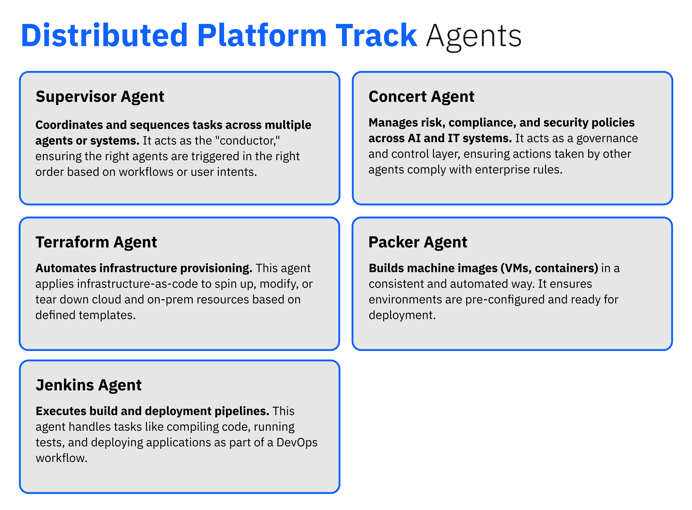
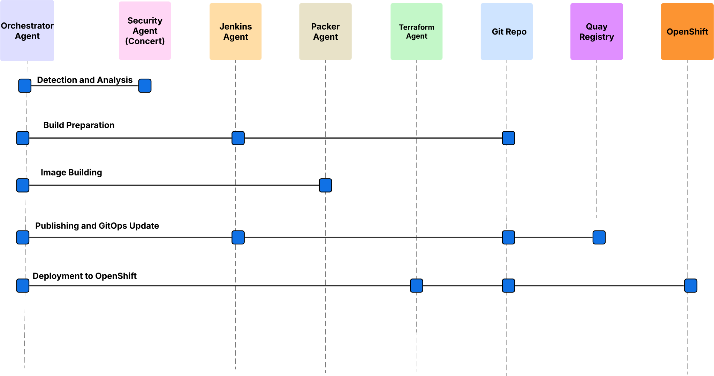
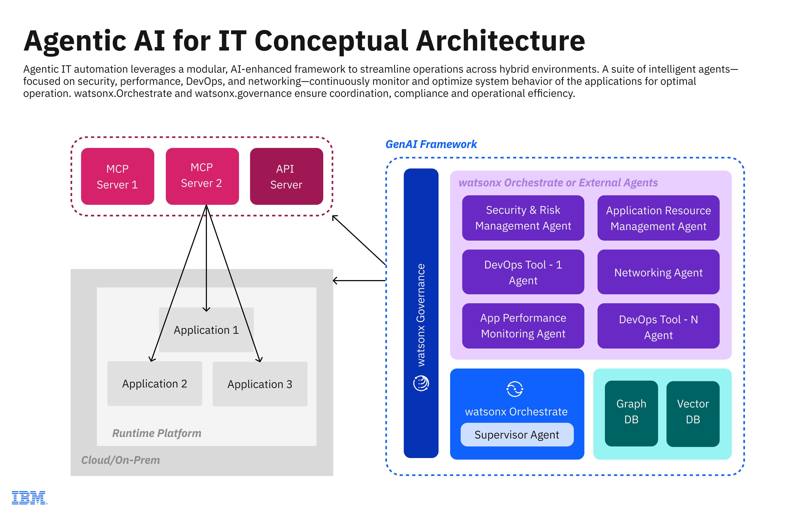

# 1. Distributed Lab Overview 🧠

This hands-on lab guides you through building a smart **IT Operations Assistant Agent** using **IBM watsonx Orchestrate and the Agent Development Kit (ADK).**

You’ll take on the role of an IT engineer and create digital agents that understand natural language, retrieve diagnostic data, and suggest actions — all powered by AI.

--- 

> ### Imagine you’re an engineer in a high-stakes enterprise environment. One morning, a critical vulnerability (CVE) hits your infrastructure!
> 
> Instead of scrambling through logs, dashboards, and patch notes, your AI-powered digital agents spring into action. They understand your natural language commands, retrieve diagnostic data, identify impacted systems, and suggest remediation steps.
> 
> Within minutes, agents prepare a patched image, update GIT configurations, and deploy securely to OpenShift — all orchestrated, all automated.
> 
> ### In this lab, you will build two agents, one using the Agent Development Kit (ADK) and another using the Model Context Protocol (MCP). These agents will then interact with three specialized agents that you import.

---

## Table of Contents

- [1. Process Flow](#1-process-flow)
- [2. Meet Your Agents](#2-meet-your-agents)
- [3. Solution Architecture](#3-solution-architecture)
- [4. Git Structure](#4-git-structure)
- [5. Lab Flow – What You’ll Build](#5-lab-flow--what-youll-build)

---

## 1. Process Flow

This lab demonstrates how agentic AI and automation tools streamline IT operations from vulnerability detection to secure deployment. 

You’ll explore a complete process flow — starting with CVE detection and analysis, moving through image patching and GIT updates, and ending with deployment to OpenShift. Along the way, you’ll see how orchestrated agents like Concert, Jenkins, Packer, and Terraform collaborate through a Supervisor agent to deliver faster, more resilient, and auditable automation.

Although the solution can support many capabilities, check out the flow below to understand what we are building towards for the lab today.

<p align="center">
  
</p>

---

## 2. Meet Your Agents

Agents are the building blocks of agentic automation. Each one specializes in a critical function — from orchestrating workflows and enforcing compliance to provisioning infrastructure, building images, and managing deployments. Together, they enable a seamless, intelligent process that transforms IT operations into a dynamic, autonomous system. 

Take a moment to understand the five agents we will be building today:

<p align="center">
  
</p>

The sequence diagram below demonstrates interactions between the components in this lab:

<p align="center">
  
</p>


---

## 3. Solution Architecture

The solution architecture brings together orchestrated agents and automation tools to deliver a secure, scalable, and intelligent IT operations workflow. Take a look at how the system works to create a seamless experience for IT.


<p align="center">
  
</p>


---

## 4. Git Structure

Here is a quick overview of your project structure and what you will find where in the Github. 

```
├── README.md
├── agents
│   ├── concert.yaml
│   ├── packer.yaml
│   └── supervisor.yaml
│   └── terraform.yaml
├── import-all.sh
├── knowledge_base
│   ├── concertdb.yaml.template
└── tools
    ├── build_image.py
    ├── deploy_image.py
    ├── fetch_alerts.py
    ├── generate_packer_config.py
    ├── scan_image.py
    ├── ssh_executor.py
    ├── update_deployment_yaml.py
    └── requirements.txt
```

| Folder / File | Description |
|----------------|-------------|
| **agents/** | Contains YAML definitions for the Orchestrate Agents|
| **files/** | Example data files for each domain. |
| **import-all.sh** | Automates tool and agent import into Orchestrate. |
| **knowledge_base/** | Configuration templates for the Orchestrate knowledge base. |
| **tools/** | Utility scripts for data retrieval and setup. |

---

## 5. Lab Flow – What You’ll Build

1. **🛠️ Set up & Configuration**  _🚨Should be completed before November 6th🚨_
   Prepare your Python virtual environment and install the watsonx Orchestrate ADK. Reserve your environment through IBM TechZone and connect it to your CLI.
    [Find the lab here](https://github.com/aishwarya-hariharan/ibm-agentic-ai-for-itops/blob/main/pre-requisties/Hands%20on%20Lab%20Pre-Requisites%20-%20Set%20Up%20&%20Configuration.md) 

3. **🤖 Agent Creation**  
   Define the agents and their tools using provided YAML and Python files.
   [Find the lab here](../Distributed_Platforms/2_Agent_Creation.md)

4. **💻 Deploy & Test**  
   Interact with your agents through natural-language queries and observe how they return real-time results. Walk through our outlined flow and try your own queries!
   [Find the lab here](../Distributed_Platforms/3_Deploy_&_Test.md)
---

<p align="center"> ✨ Let's get started!✨</p>

-->  [Get started on creating your agents here](../Distributed_Platforms/2_Agent_Creation.md)


---


