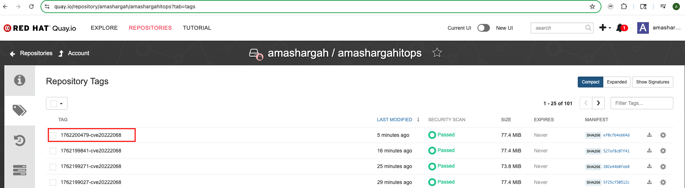
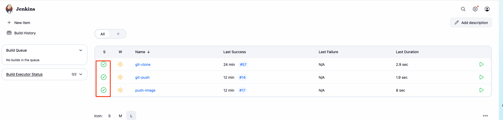
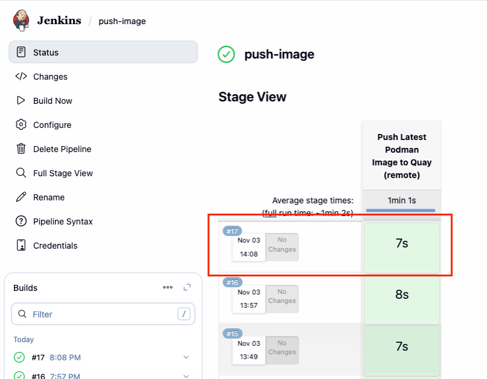
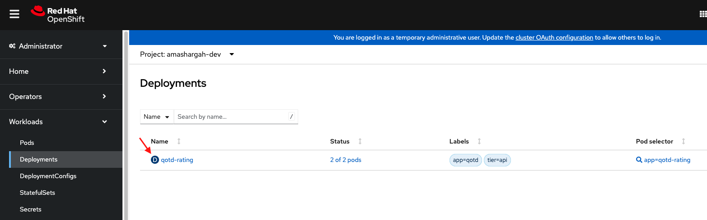
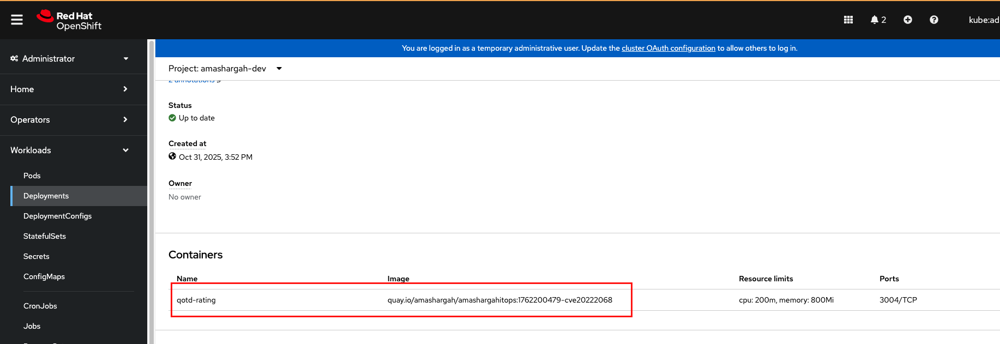

# 3. Deploy & Test 💻

Put your agents to work! Interact with them using natural-language queries, observe real-time responses, and walk through the full process flow. 

As a reminder here is the base flow we will start with:

<p align="center">
  
</p>

---

## Step 1 - Testing the Agent End-to-End

- After successful integration,  navigate to **Orchestrate chat**


- From Agents, drop down and select the “Supervisor_Agent”


You’ll see the Orchestrate Agent:
1. Parse your intent.  
2. Invoke the MCP Server tool.  
3. Display progress logs as the image is rebuilt and tagged.  
4. Return success message with new image details.

### Trigger the Flow

1. To begin, simply type ```fetch alerts``` into the chat

This command instantly activates the Supervisor Agent, which pulls in the Concert Agent to conduct a rapid risk assessment. Together, they diagnose the situation: What's broken? How severe is the impact? And what’s the most effective solution? This is the system's brainstorming phase, where it maps out a complete plan for remediation.

> Note on Real-World Implementation:
> 
> In a production environment, the manual `fetch alerts` command used in this lab is replaced by **automated, event-driven triggers**. Real-world implementations typically use one or more of the following approaches:
> - **Webhooks & Event Streams:** Security tools (SIEM, vulnerability scanners) and observability platforms (Prometheus, Datadog, Splunk) push alerts directly to your agentic system via webhooks or message queues (Kafka, RabbitMQ)
> - **Scheduled Polling:** Periodic API calls to security feeds (CVE databases, threat intelligence), infrastructure monitoring systems, and log aggregators to identify anomalies, vulnerabilities, or performance degradation
> - **Real-Time Event Processing:** Integration with event buses or streaming platforms that trigger the Supervisor Agent immediately when critical conditions are detected (e.g., critical CVE published, service down, unusual traffic patterns)
>
> This creates a self-healing, autonomous workflow where the agentic system continuously monitors, detects, diagnoses, and remediates issues without human intervention, only escalating when necessary.


### 1. Detection & Analaysis


### 2. Build Golden Image

Type: 
```Build the new image for patching CVE ID: CVE-2025-23009```


The Orchestrator Agent calls in Jenkins Agent, which heads to the Git repository like a mechanic fetching spare parts. Jenkins clones the source code, checks the right branch, and sets up the workspace.

Then the Packer Agent steps in to build a new image, a clean, patched version of your system. It injects the fix, compiles the necessary code, and locks in the right configurations. And finally Jenkins Agent pushes the image to the Quay registry.


> Note on Human-in-the-Loop Implementation:
>
> The manual command **"Build the new image for patching CVE ID: CVE-2025-23009"** demonstrates a human-in-the-loop (HITL) pattern, where critical remediation actions require explicit human approval before execution.
> 
> **Why This Matters:** In the early stages of agentic system deployment, requiring human confirmation for high-impact actions (building images, deploying patches, modifying infrastructure) provides:
> - **Safety guardrails** against unintended consequences
> - **Learning opportunities** to observe agent decision-making
> - **Audit trails** with explicit approval points
> - **Risk mitigation** during the trust-building phase
> 
> **Evolving Toward Full Autonomy:** As your solution matures and you build confidence in your agents' decision-making capabilities, you can **progressively reduce or eliminate these manual interventions.**

### 3. Deployment to OpenShift

Type:
```Deploy image```


Terraform Agent applies the updated deployment YAML


> Note: **Human-in-the-Loop: Deployment Approval**
>
> The manual command **"Deploy image to OpenShift cluster"** is another **human-in-the-loop checkpoint **for production deployments. As discussed earlier, this approval step can be removed once your agent governance matures, allowing the Supervisor Agent to automatically deploy patches based on predefined policies (e.g., deploy to dev/staging automatically, require approval only for production, or schedule deployments during maintenance windows).

---

### 4. Verify

Let's verify what happened in the backend, you can access Quay, Jenkins, and OpenShift Cluster:

- From Quay Registry check the image tag:

<p align="center">
  
</p>

- Using Jenkins server URL, access the instance and verify that the pipelines got executed:

<p align="center">
  
</p>

> You can click on any pipeline to check the details
>
> <p align="center">
>  
> </p>

- To confirm that the deployment YAML got pushed with the new patched image, access the OCP cluser and navigate to your namespace:

  Workloads > Deployments > Click on `qotd-rating`

<p align="center">
  
</p>

- Scroll down to containers section to check the image tag:

<p align="center">
  
</p>


---

<p align="center">✨ Congratulations on completing the flow!🎊✨ </p>

