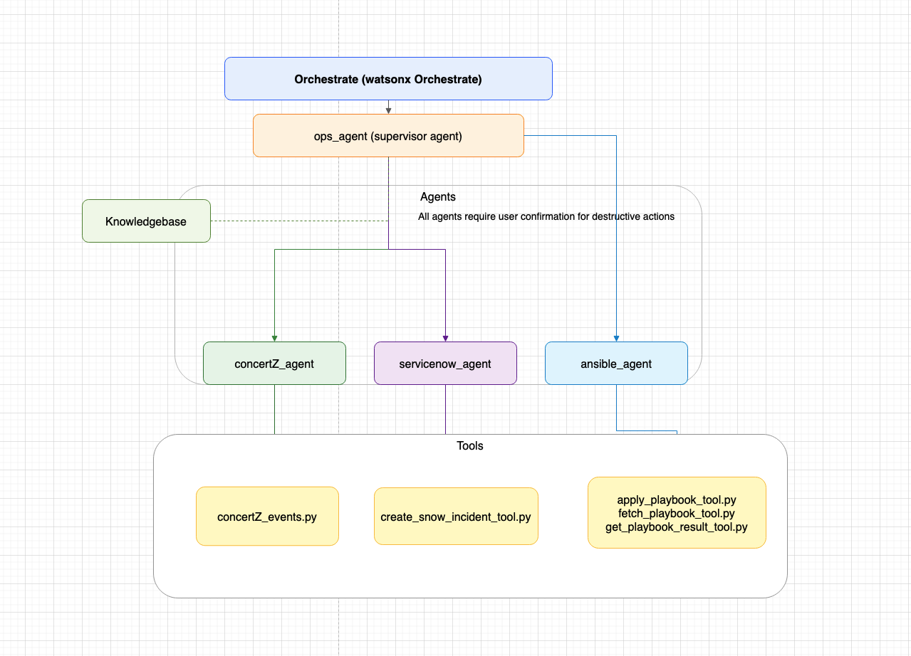

# 1. Mainframe Lab Overview 🧠

> This hands-on lab guides you through building a smart **IT Operations Assistant Agent** using **IBM watsonx Orchestrate and the Agent Development Kit (ADK).**

---

## Table of Contents

- [1. Process Flow](#1-process-flow)
- [2. Meet Your Agents](#2-meet-your-agents)
- [3. Solution Architecture](#3-solution-architecture)
- [4. Git Structure](#4-git-structure)
- [5. Lab Flow – What You’ll Build](#5-lab-flow--what-youll-build)
- [6. Lab Objectives](#6-lab-objectives)

---

## 1. Process Flow

This Mainframe Track lab demonstrates how agentic AI and automation simplify mainframe resilience and operational workflows by connecting data-driven insights with automated actions.

You’ll explore how orchestrated agents — Supervisor, Concert for Z, ServiceNow, and Ansible — collaborate to detect anomalies, validate responses, and apply fixes across hybrid environments.

Although the solution can support many capabilities, check out the flow below to understand what we are building towards for the lab today:


---

## 2. Meet Your Agents

Take a moment to understand the five agents we will be building today:

<p align="center">
 
</p>

---

## 3. Solution Architecture

The solution integrates watsonx Orchestrate Agents with Z AIOps and automation tools to create a closed-loop system that continuously maintains mainframe health.

- Concert for Z Agents deliver anomaly detection, event correlation, and AI-based recommendations.
- ServiceNow Agent ensures traceable documentation and governance.
- Ansible Agent applies verified fixes automatically.
- Supervisor Agent oversees coordination, ensuring efficient and reliable task execution.

This architecture enables proactive, AI-augmented mainframe operations — reducing downtime and supporting business continuity.

<p align="center">
 
</p>

---

## 4. Git Structure

Here is a quick overview of your project structure and what you will find where in the Github.

```
├── 1. Mainframe Lab Overview
├── Operation Insights
│   ├── README
│   ├── import-all.sh
│   ├── agents
│   │   ├──
│   ├── tools
│   │   ├──
│   ├── supported_docs
│   │   ├──
├── Resilience APAR Insights
│   ├── README
│   ├── import-all.sh
│   ├── agents
│   │   ├──
│   ├── tools
│   │   ├──

```

| Folder / File     | Description                                          |
| ----------------- | ---------------------------------------------------- |
| **agents/**       | Contains YAML definitions for the Orchestrate Agents |
| **import-all.sh** | Automates tool and agent import into Orchestrate.    |
| **tools/**        | Utility scripts for data retrieval and setup.        |

---

## 5. Lab Flow – What You’ll Build

1. **🛠️ Set up & Configuration** _🚨Should be completed before November 6th🚨_ <br>

   Prepare your Python virtual environment and install the watsonx Orchestrate ADK. Reserve your environment through IBM TechZone and connect it to your CLI.
   [Find the lab here](https://github.com/aishwarya-hariharan/ibm-agentic-ai-for-itops/blob/main/pre-requisties/Hands%20on%20Lab%20Pre-Requisites%20-%20Set%20Up%20&%20Configuration.md)

2. **👁️ Operational Insights**

   First half of our lab today! Focuses on detecting and resolving performance issues in mainframe systems. It starts by analyzing CICS data to identify bottlenecks, then applies fixes using automation and orchestration tools to restore optimal performance quickly.
   [Find the lab here](../Mainframe_Platforms/Operation_Insights/2.Operational_Agent_Flow.md)

3. **🛡️ Resilience APAR Insights**

   Second half of the flow - Ensures system stability and compliance by gathering resilience data, validating pending updates, and applying changes through automated workflows. This process strengthens readiness and minimizes risk before updates are deployed.
   [Find the lab here](../Mainframe_Platforms/Resilience_APAR_Insights/3.Resilience_APAR_Flow.md)
   
---

### 6. Lab Objectives

This lab is about transforming operational response from reactive troubleshooting to proactive resilience automation.

By completing it, you will learn:

- How AI-driven agents streamline Z systems operations and remediation.
- How orchestration unifies observability, automation, and ITSM workflows.
- How to design end-to-end automation pipelines using watsonx Orchestrate ADK.

In the end, you’ll have an intelligent Mainframe Operations Assistant capable of identifying issues, coordinating fixes, and maintaining system health autonomously — even during the busiest days of the year.

---

<p align="center"> ✨ Let's get started! ✨</p>


[--> Find the lab here](../Mainframe_Platforms/Operation_Insights/2.Operational_Agent_Flow.md)

---
