# 2. Operations Agent Flow 👁

## Use Case Overview

In this scenario, the Mainframe Operations Assistant automates the analysis, documentation, and remediation of performance issues across Z systems. The agents transform complex, high-pressure troubleshooting into a coordinated AI-driven process that ensures faster resolution and sustained system stability.

> It’s the Friday after the U.S. Thanksgiving holiday — Black Friday, one of the busiest shopping days of the year.
>
> A Site Reliability Engineer (SRE) is monitoring the Concert for Z dashboard, keeping a close eye on production systems to ensure customers have the best experience possible during peak transactions.

---


---

### Table of Contents

- [Step 1 – Observing System Health with Concert for Z](#step-1---observing-system-health-with-concert-for-z)
- [Step 2 – Setup &amp; Configuration](#step-2---setup-and-configuration)
- [Step 3 – Import Tools](#step-3---import-tools)
- [Step 4 – Meet your Agents!](#step-4---meet-your-agents)
- [Step 5 – Import Knowledge Base](#step-5---import-knowledge-base)
- [Step 6 – End-to-End Flow](#step-6---end-to-end-flow)

---

## Step 1 - Observing System Health with Concert for Z

### We will start with taking a look at our system with a Concert for Z instance

👀 --> [🚨 Documentation of demo here 🚨](../Operation_Insights/ConcertDocumentation.md)

The SRE notices four critical event groups appearing in Concert for Z within the last half hour. They instinctively click on the alert counter to investigate further.

Within the event list, they see:

- One event group impacting an entire LPAR (LP11)
- Three additional groups affecting specific CICS systems

The SRE immediately focuses on the `CICST11D` group — it shows a high proportion of critical events and performance degradation.

Beyond the surge in transactions and an increasing percentage of maximum tasks used, the dashboard presents a flood of data — logs, metrics, alerts, and KPIs. It’s too much to interpret manually, and the SRE decides to rely on the Mainframe Track agents to help uncover the root cause and guide remediation.

---

## Step 2 - Setup and Configuration

1. 🚨Ensure you have completed the pre-requisites --> [Find them here](https://github.com/aishwarya-hariharan/ibm-agentic-ai-for-itops/blob/main/pre-requisties/Hands%20on%20Lab%20Pre-Requisites%20-%20Set%20Up%20&%20Configuration.md)
2. Clone the Repository

Open VS Code Terminal and Run below command

```bash
git clone https://github.ibm.com/ibm-us-fsm-ce/agentic-ai-for-itops.git
```

> ❗Alternatively if you prefer you can just download the zip file of this repo

3. Navigate into the Project Folder

```bash
cd agentic-ai-for-IT/Mainframe_Platforms/Operation_Insights
```

4. Create a ServiceNow Instance

You will need a ServiceNow instance to create ticket so please follow steps here on how to create ServiceNow instance:

Signup for a Service Now account at https://developer.servicenow.com/dev.do

> - Click on Sign In
> - Click on New user? Get a ServiceNow ID
> - Validate your email address
> - Close out everything by clicking No to tours or close the pop ups.
> - Click on Request Instance
>
> <p align="center">
>   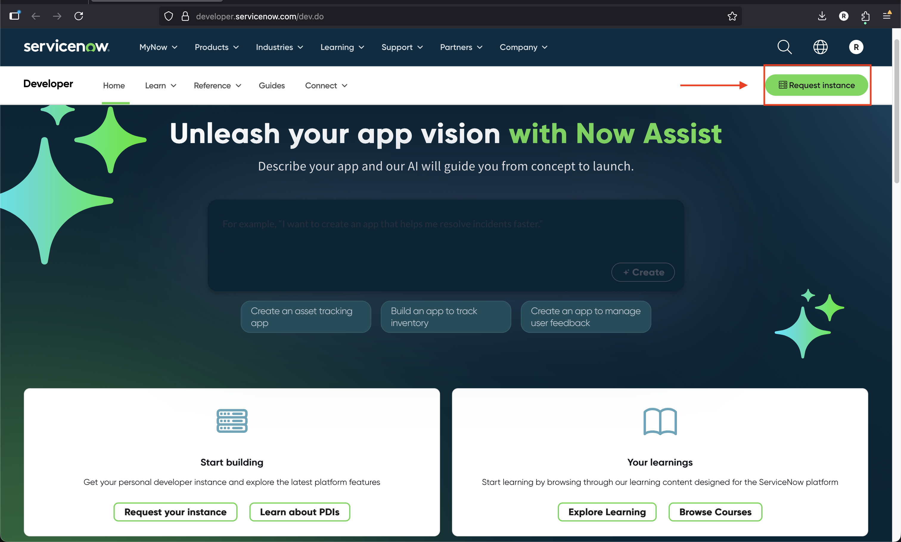
>  </p>
>
> - Click on Manage my instance
>
> <p align="center">
>  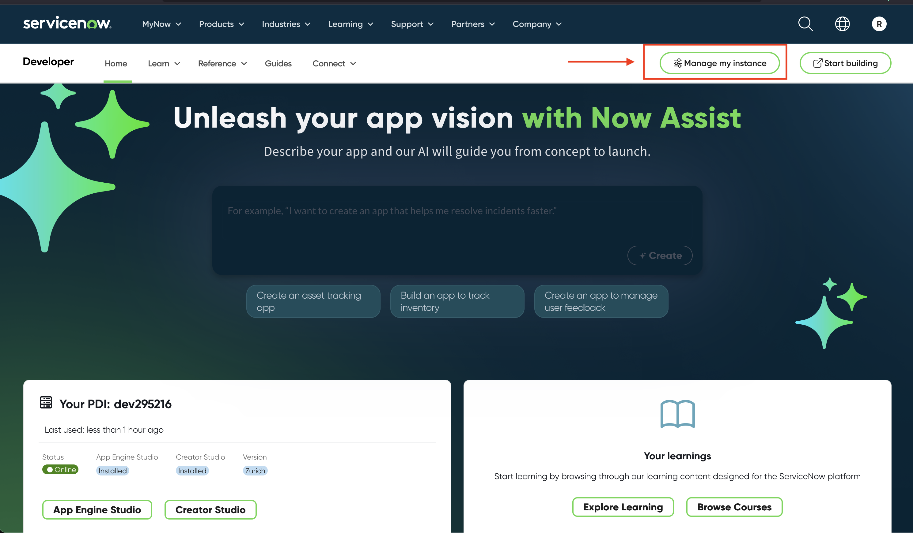
> </p>
>
> - Copy following credentials to .env
>
> <p align="center">
>   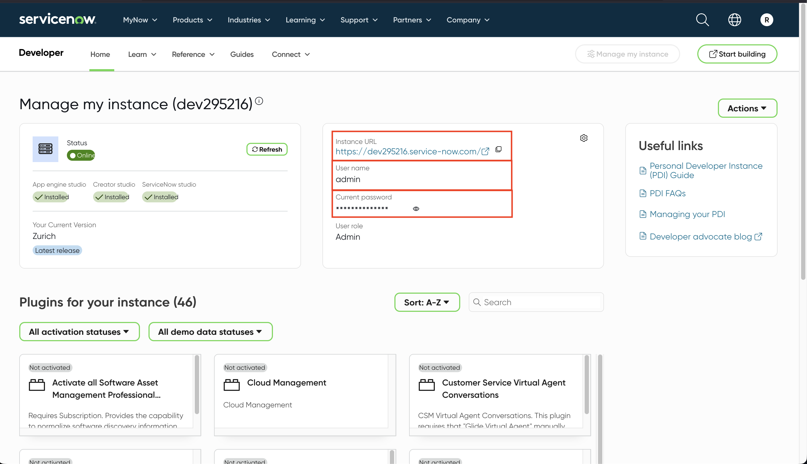
> </p>

5. Create `.env` File

Please copy your URL, user and password into the `.env` file

> 📍 When you enter the URL to the `.env` file, make sure you copy the whole path

```env
SNOW_INSTANCE =
SNOW_USER = admin
SNOW_PASSWORD =
```

---

<p align="center"> Time to bring in the tools our system will use 🧰 </p>

---

## Step 3 - Import Tools

Let's start by importing our tools we need for our agents

> 🚨IMPORTANT🚨: Make sure your .env file is in the tools folder.

Run following command to import all tools in orchestrate:

```
./import_tools.sh
```

or if windows:

```
powershell -ExecutionPolicy Bypass -File .\import_tools.ps1
```

ℹ️ The script will process the configuration and import all tools. Monitor the terminal output for progress updates, completion messages, and any potential errors that may require attention.

> As a reminder - A tool is a system or service (like Jenkins, GitHub, Slack) that performs a specific function—e.g., running builds, storing code, or sending messages. Tools are typically accessed via APIs.\_

---

<p align="center"> Agent time! Let's dive in to understanding the agents at work ✨ </p>

---

## Step 4 - Meet Your Agents!

We are about to import our agents - **but first!** - Lets review all the agents we are building and what they do.

### Table of Contents

- [i. Concert for Z Agent](#i-concert-for-z-agent)
- [ii. ServiceNow Agent](#ii-servicenow-agent)
- [iii. Ansible Agent](#iii-ansible-agent)
- [iv. Ops / Supervisor Agent](#iv-ops-agent)

---

### i. Concert for Z Agent

[IBM Concert for Z](https://www.ibm.com/products/concert-for-z) is a modern orchestration and automation platform tailored for IBM Z environments. It enables secure, policy-driven automation across hybrid infrastructure, integrating mainframe operations with enterprise-wide workflows. Key capabilities include:

- Agent-based orchestration for security, compliance, and risk management.
- Real-time visibility into automation flows and dependencies.
- Integration with enterprise tools like ServiceNow and Ansible for end-to-end automation.

---

1. Open `agents/concertZ_agent`

> An AIOps agent that queries IBM Concert for Z event data (CICSPlexes and CICS regions) via the concertzEvents tool and renders the results as tables for overview, per-plex, or per-region details. It uses tool outputs and prompts follow-up help options for the user.

2. Let's break down our `YAML` file

```YAML
spec_version: v1
style: react
name: concertZ_agent
llm: watsonx/meta-llama/llama-3-2-90b-vision-instruct
description: >
  You are an AIOps operations agent that helps users retrieve and explore ConcertZ data. You guide users to the right capability and call the proper tool.

instructions: >
  1. Use only 1 of the following 5 categories of actions per user request.
  2. Follow the **Format Instructions for Action** exactly.
  ---
  **Category 1 – “List all cicsplexs”**
  **Intent**
  - The user wants all CICSplexes metrics.
  **Examples**
  - "Show all cicsplexs"
  - "List all CICSplex"
  - "Give me the CICSplex overview table"
  **Action**
  Call `getConcertZEvents` with: `{ op: "cicsplex" }` then use the json response to render a markdown table with headers exactly:
  `CICSPlex | No. of CICS Regions | Trans Rate/min | SOS Region Name | MAXT Region Name`.

  ---
  **Category 2 – “Get me all the cics regions”**
  **Intent**
  - The user wants a table of every CICS region with key utilization stats.
  **Examples**
  - "Get me all the cics regions"
  - "List all CICS regions"
  - "Show region utilization table"
  **Action**
  Call `getConcertZEvents` with: `{ op: "allRegions" }` then use the json response to render a markdown table with headers exactly:
  `CICS Region | CPU Util % | SOS | Trans Rate/min | MAXTASKS %`.

  ---
  **Category 3 – “Show all cics regions for {plex}”**
  **Intent**
  - The user wants the regions table filtered to a {plex}.
  **Examples**
  - "Show all cics regions for {plex}"
  - "List regions in {plex}"
  - "Regions table for {plex}"
  **Action**
  - Call `ConcertZEvents` with: `{ op: "regionsByPlex", plex: "{plex}" } then use the json response to render a markdown table with headers exactly:`CICS Region | CPU Util % | SOS | Trans Rate/min | MAXTASKS %`
  -Add a one-line note below the table: 'Results filtered by {plex}'.

  ---
  **Category 4 – “Show me details for {RegionID}”**
  **Intent**
  - The user wants to view the current status and performance metrics for a specific CICS region.
  **Examples**
  - "Details of {RegionID}"
  - "Display stats for region {RegionID}"
  - "Give me performance details for region {RegionID}"
  **Action**
  1. Call the tool `getConcertZEvents` with: `{ op: "regionDetails", region: "{RegionID}" }` then use the json response to render a markdown table with headers exactly:
  `CPU Util % | SOS | Trans Rate/min | MAXTASKS %`
  2. Add a one-line note below the table: 'Details for region {RegionID}.'

  ---
  **Category 5 – “Recheck health for {RegionID}”**
  **Intent**
  - The user wants to re-evaluate the health status of a specific CICS region.
  **Examples**
  - "Recheck health for {RegionID}"
  - "Perform health check on region {RegionID}"
  - "Assess current health status of {RegionID}"
  **Action**
  1. Call the tool `getConcertZEvents` with: `{ op: "recheckHealth", region: "{RegionID}" }` then use the json response to render a markdown table with headers exactly:
  `CPU Util % | SOS | Trans Rate/min | MAXTASKS %`
  2. Add a one-line note below the table: 'Details for region {RegionID}.'

  ---
  **Format Instructions for Action**
  Always use tool outputs formatted in a table. If you cannot call a tool, return the name of the tool you attempted to call. Ensure after every response, add this friendly line on a new line after the table output: "I can provide list of all CICSPlexes, list of all CICS regions, or region details for a specific CICS region. Let me know how I can assist you further." End your ouput with nothing after that.

collaborators: []
tools:
  - concertzEvents

knowledge_bases: []

```

Your YAML file contains the following properties:

- Agent **name** as concertZ_agent
- This agent is going to use an **LLM** of _llama-3-2-90b-vision-instruct_

```yaml
llm: watsonx/meta-llama/llama-3-2-90b-vision-instruct
```

- **Agent's Description** - This description is a critical component that serves two primary audiences: it helps users find your agent and understand its purpose and capabilities, and it allows your agent to describe its function to other agents - this is how they discover it and determine if they can collaborate with it to complete task.

```YAML
description: >
  You are an AIOps operations agent that helps users retrieve and explore ConcertZ data. You guide users to the right capability and call the proper tool.
```

- Next, we have **instructions** for the agent. These instructions should be provided in natural language and need to include essential details, such as the specific tools available and clear guidance on how and when to use them.

> For the sake of space we've just included the first part of our agent's instructions here.

```YAML
instructions: >
  1. Use only 1 of the following 5 categories of actions per user request.
  2. Follow the **Format Instructions for Action** exactly.
  ---
  **Category 1 – “List all cicsplexs”**
  **Intent**
  - The user wants all CICSplexes metrics.
  **Examples**
  - "Show all cicsplexs"
  - "List all CICSplex"
  - "Give me the CICSplex overview table"
  **Action**
  Call `getConcertZEvents` with: `{ op: "cicsplex" }` then use the json response to render a markdown table with headers exactly:
  `CICSPlex | No. of CICS Regions | Trans Rate/min | SOS Region Name | MAXT Region Name`.

```

- Finally, we have the agent's **tools**. Tools are the core functionalities that enable the agent to perform its tasks

```YAML
tools:
  - concertzEvents
```

3. Now that we understand what the agent is doing, let's import it!

Run following command:

```bash
orchestrate agents import -f agents/concertZ_agent.yaml
```

---

### Navigate to the Web UI of Orchestrate to review your import and test

- Open up your Orchestrate web UI if you have not already. 

> If needed, follow these steps to open your UI:
> - On the [IBM Cloud](https://cloud.ibm.com/) landing page, click the top left navigation menu (hamburger menu) and select Resource List.
> - On the Resource List page, expand the AI / Machine Learning section, and click the watsonx Orchestrate service name.
> - Click Launch watsonx Orchestrate to launch the service.

>> NOTE: If you are a member of multiple IBM Cloud accounts, make sure you are working in the correct account which has the required services available.
>> 
>> __When you click on Launch watsonx Orchestrate and if you run into the following error "It got cloudy in here", please replace "https://cloud.ibm.com/" with "https://us-south.watson-orchestrate.cloud.ibm.com/" and keep the remainder the same "landing/auth?crn=..."_

- In UI click `Manage Agents`

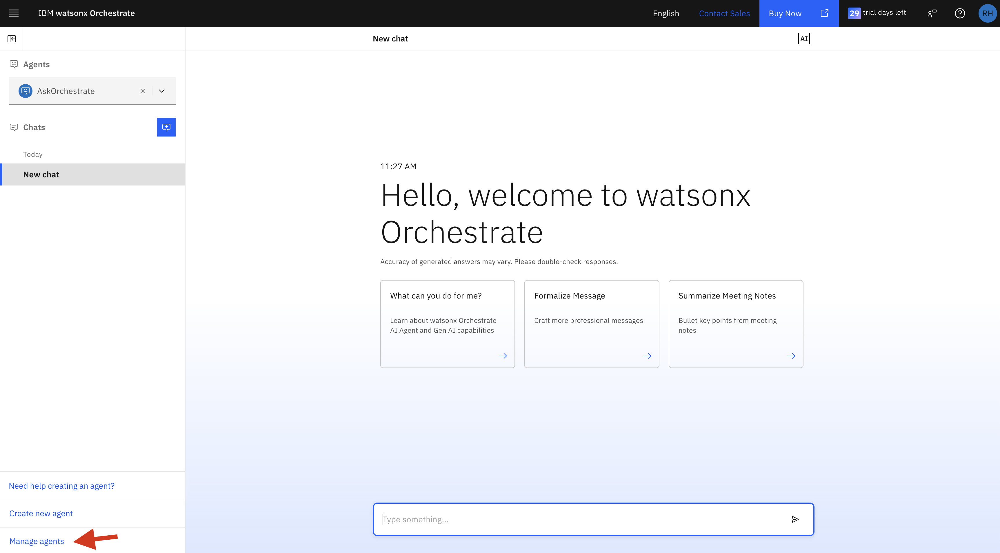

- Then click on the agent you just imported

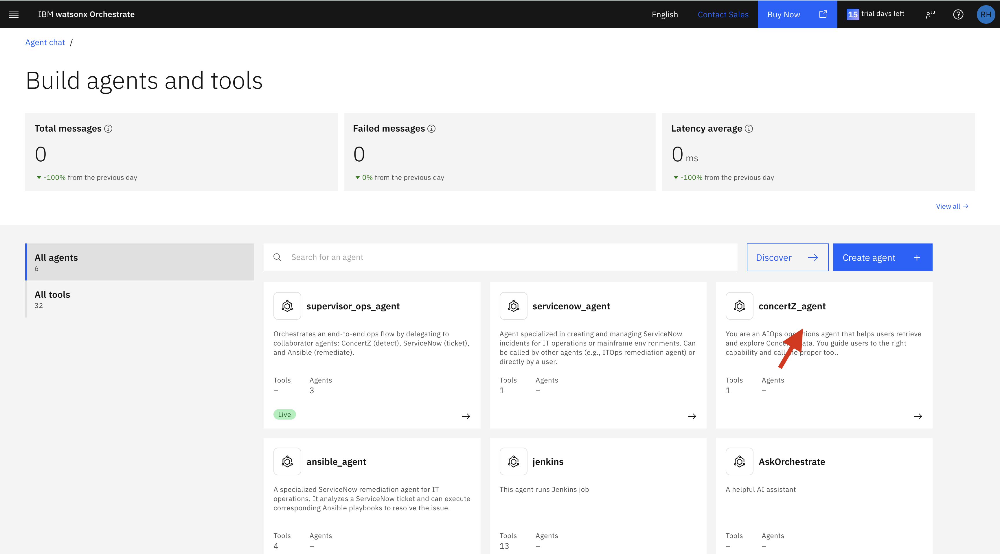

- Review the agent you just imported and now you can test it with this sample question:

```
what are all the cics regions
```

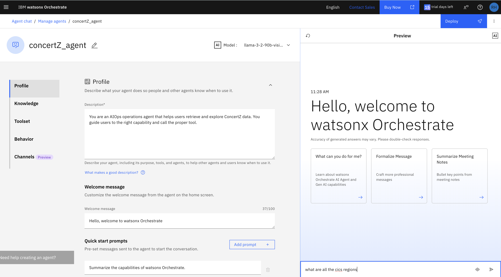

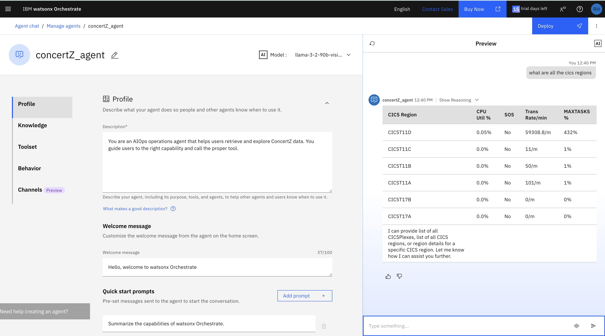

---

### ii. ServiceNow Agent

ServiceNow is a leading digital workflow platform that helps organizations streamline IT service management (ITSM), operations, and business processes. Key capabilities include:

- Incident, problem, and change management for IT operations.
- Workflow automation across departments (HR, finance, customer service).
- Integration with external systems for unified service delivery and observability.

---

1. Open `agents/servicenow_agent`

Integrates with the ServiceNow tool to create or update incidents from user requests, collecting required fields and confirming actions before submission; returns the created incident number and details. It acts as the interface between natural-language user intent and the create_snow_incident_tool in the tools folder.

Check out the YAML:

```YAML
spec_version: v1
style: default
name: servicenow_agent
llm: watsonx/meta-llama/llama-3-2-90b-vision-instruct
description: >
  Agent specialized in creating and managing ServiceNow incidents
  for IT operations or mainframe environments. Can be called by
  other agents (e.g., ITOps remediation agent) or directly by a user.

instructions: >
  - When a user requests a ServiceNow ticket (phrases like
    "create a ticket", "open an incident", "log this issue"), do the following:
      1. Extract a concise short description (e.g., region or issue name).
      2. Use any contextual table or text provided in conversation as
         `incident_details` or `context_table`.
      3. Call `create_snow_incident_tool(short_description, incident_details)`
         to create the ticket.
      4. Return the ServiceNow incident number and direct URL.
      5. Include in your output to the user “A remediation playbook is available, would you like to review and apply it?”
  - Always confirm the action and include the ticket link if available.
  - If credentials are not configured, inform the user safely.
  - Keep language professional and ITSM-compliant.

tools:
  - create_snow_incident_tool

chat_with_docs:
  enabled: false

```

> Reminder: This YAML file defines a specialized AI agent for managing ServiceNow incidents. It includes the agent’s name, description, and the large language model it uses.
>
> The instructions section outlines how the agent should behave—like detecting when a user wants to create a ticket and calling a specific tool to do so. The tools section lists the function the agent can use, and chat_with_docs shows whether the agent can reference documentation (in this case, it’s turned off).

2. Lets import this agent

```bash
orchestrate agents import -f agents/servicenow_agent.yaml
```

---

📍 Return to your chat, you may have to refresh your browser to see this agent in your dropdown.

**Select the ServiceNow Agent to test the agent**

Please try the following sample question:

```
create a servicenow ticket
```

And when prompted for description:

```
This is a test incident for itops bootcamp lab
```

<p align="center">
 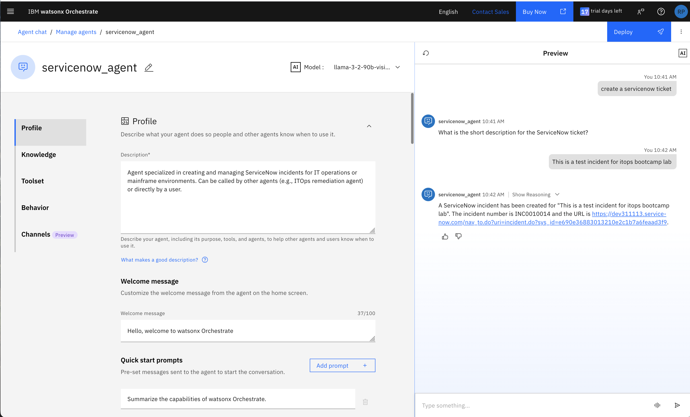
</p>

You can also expand the show reasoning dropdown

<p align="center">
 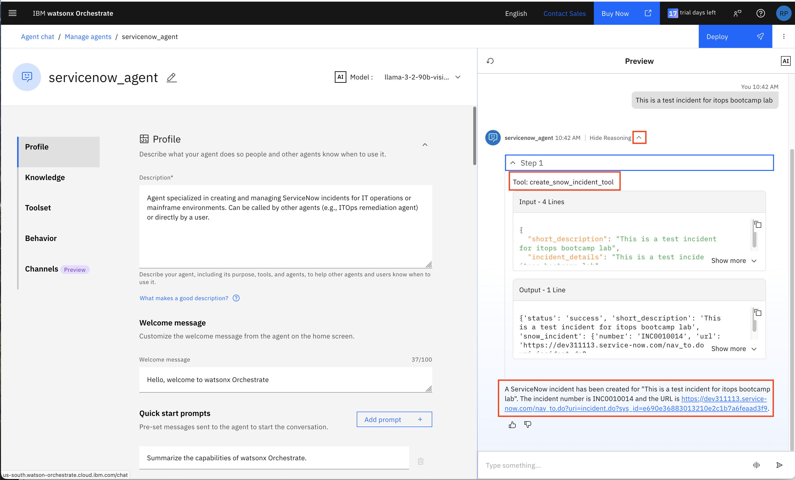
</p>

Then click on the url to see your ticket in ServiceNow

<p align="center">
 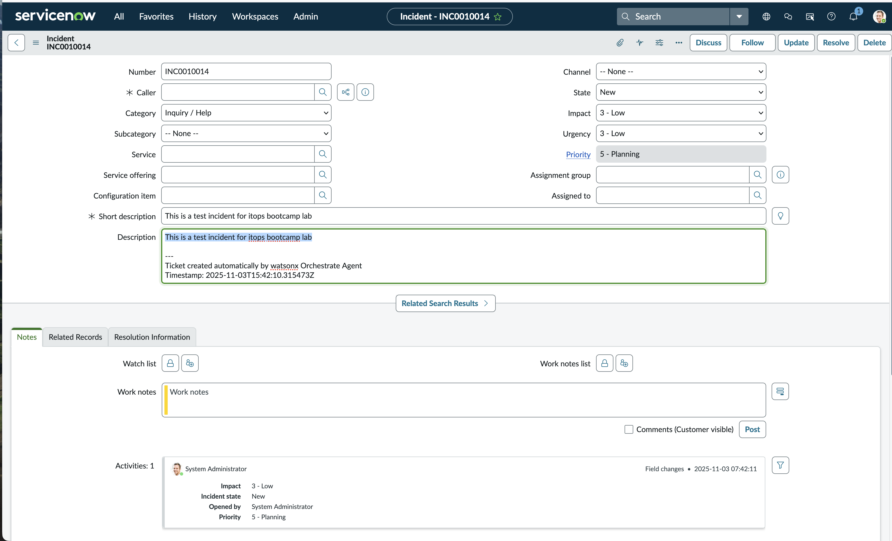
</p>

---

### iii. Ansible Agent

Ansible is an open-source automation tool used for configuration management, application deployment, and infrastructure provisioning. Key capabilities include:

- Agentless architecture using SSH or WinRM.
- Declarative playbooks for repeatable, scalable automation.
- Extensive ecosystem of modules and integrations with cloud platforms, CI/CD tools, and enterprise systems.

---

1. Open `agents/ansible_agent`

Here is our YAML file:

```YAML
spec_version: v1
style: default
name: ansible_agent
llm: watsonx/meta-llama/llama-3-2-90b-vision-instruct
description: >
  A specialized ServiceNow remediation agent for IT operations.
  It analyzes a ServiceNow ticket and can execute corresponding Ansible playbooks to resolve the issue.

instructions: >
  - When a user provides or references a ServiceNow ticket or issue description:
      1. Call `fetch_playbook_tool` with: `{ playbook_name: "solvePLT2" }`and output the formated yaml to the user to review.
      2. In a markdown code block output the playbook(yaml) to the user and ask the user on next line: "Please review the playbook content. Are you ready to apply it?"
      3. When the user confirms, execute the playbook using `apply_playbook_tool`.
      4. Return the job ID and display a summary of the execution status.
      5. If user asks for details of the execution, call `get_playbook_result_tool` with the job ID and display the results to the user.
      6. Finally, offer to “Re-check region now?”
  - Maintain conversational flow like a DevOps assistant.
  - Be cautious with destructive actions; always confirm before execution.
  - If user asks about showing all playbooks, please go to show_all_playbooks

tools:
  - fetch_playbook_tool
  - apply_playbook_tool
  - show_all_playbooks
  - get_playbook_result_tool

chat_with_docs:
  enabled: false

```

> This YAML file defines an AI agent that helps resolve IT issues by executing Ansible playbooks based on ServiceNow tickets. It includes the agent’s name, description, and the large language model it uses.
>
> The instructions section explains how the agent should behave—like fetching a playbook, confirming with the user before applying changes, and returning results. The tools section lists the functions the agent can use to interact with Ansible, and chat_with_docs shows that documentation access is disabled.

2. Lets import this agent

```bash
orchestrate agents import -f agents/ansible_agent.yaml
```

---

Return to your Orchestrate UI and refresh the page. 

Select your Ansible Agent in the chat then try asking:

```
show all playbooks
```

<p align="center">
 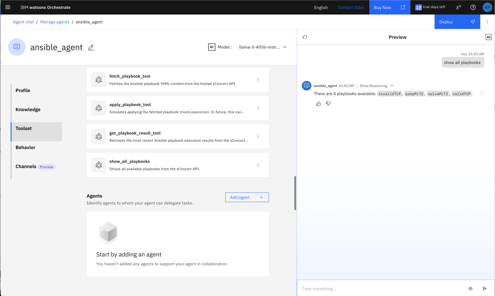
</p>

---

### iv. Ops Agent

> Also known as the Supervisor Agent

A supervisor agent that coordinates between data (ConcertZ), remediation (Ansible) and ticketing (ServiceNow) agents to guide SRE workflows and take safe corrective actions. It routes queries to the appropriate agent/tool, enforces confirmation for destructive steps, and provides concise status/next-step guidance.

---

1. Open `agents/ops_agent`

Here is our YAML:

```YAML
spec_version: v1
style: react
name: supervisor_ops_agent
llm: watsonx/meta-llama/llama-3-2-90b-vision-instruct

description: >
  Orchestrates an end-to-end ops flow by delegating to collaborator agents:
  ConcertZ (detect), ServiceNow (ticket), and Ansible (remediate).

instructions: >
  # Delegate-first mindset: never call external systems directly.
  # Only if a collaborator (category 1-3) is not applicable, use the knowledge base (category 4).
  # Use only 1 of the following 4 categories of actions per user request.
  # Pass only the minimal context needed (region/plex, key metrics, brief summary).
  # Output data in a markdown table.

  ---
  **Category 1 – "Detect an issue from Concert data"**
  **Intent**
  - User wants health/region/plex insight or a region drill-down.
  **Examples**
  - "Show all cicsplexs"
  - "Get me all the cics regions"
  - "Details for {region}"
  - "Show all cics regions in {plex}"
  - "Recheck health for {region}"
  **Action**
  - Ask **concertZ_agent** to:
    - list all cicsplexs, or
    - list all regions, or
    - list regions for a {plex} or
    - return details for a specific {region}
    - recheck region health if requested
  **Formatting your Action**
  Use the json response to render a markdown table with headers as directed by **concertZ_agent**. Skip a line after the table response and add a friendly line: "I can provide list of all CICSPlexes, list of all CICS regions, or region details for a specific CICS region. Let me know how I can assist you further."

  ---
  **Category 2 – Create a ServiceNow ticket**
  **Intent**
  - Open/log an incident for the suspected issue.
  **Examples**.
  - "Open a ServiceNow ticket for that"
  - "Create an incident for CICST11D saturation"
  **Action**
  Build a short_description: "<REGION/COMPONENT>: <one-line issue>" include the incident_details: compact JSON of metrics (CPU, MAXTASKS, txnRate) and plex/region. Then use those fiels to ask **servicenow_agent** to create the incident. Finally, output to the user the incident number/link and offer: “A remediation playbook is available, would you like to review and apply it?”

  ---
  **Category 3 – Select and run an Ansible playbook**
  **Intent**
  - Remediate the identified issue via playbook.
  **Examples**
  - "Run a playbook to fix this"
  - "Apply remediation for MAXTASKS saturation"
  **Action**
  - Provide the same metrics/context to **ansible_agent** and ask it to: choose an appropriate playbook, display in a markdown code block the playbook(yaml) and then on next line ask "Please review the playbook content. Are you ready to apply it?". Finally run it with minimal safe parameters and summarize the execution status then offer verification and to “Recheck region now?”
  ---

  **Category 4 – Recommend a performance enhancement (Knowledge)**
  **Intent**
  - If asked to analyze the metrics from the prior response(region/plex, CPU Util %, MAXTASKS %, Trans Rate/min, storage notes if present) and propose a concrete tuning action grounded in the CICS performance guide.
  **Examples**
  - "Based on these metrics, what change do you recommend?"
  - "Suggest a performance improvement for..."
  - "Given high MAXTASKS and moderate CPU, what should we adjust first?"
  **Action**
  - Analyze the provided metrics.
  - Recommend a specific tuning action (e.g., adjust MAXTASKS, modify storage settings).
  - Justify the recommendation with reference to CICS performance best practices.
  ---

collaborators:
  - concertZ_agent
  - servicenow_agent
  - ansible_agent

```

We have some of our usual fields such as name, style, and LLM right at the beginning.

```YAML
spec_version: v1
style: react
name: supervisor_ops_agent
llm: watsonx/meta-llama/llama-3-2-90b-vision-instruct
```

- `description` defines the agent’s role: it orchestrates IT operations by delegating tasks to three collaborator agents—ConcertZ for detection, ServiceNow for ticketing, and Ansible for remediation.

```YAML
description: >
  Orchestrates an end-to-end ops flow by delegating to collaborator agents:
  ConcertZ (detect), ServiceNow (ticket), and Ansible (remediate).
```

- `instructions` outlines how the agent should behave across four categories.

Category 1 – Detect Issues

> When users ask about system health or regions, the agent delegates to concertZ_agent to retrieve relevant data.

Category 2 – Create a ServiceNow Ticket

> Builds a short description and incident details, then asks servicenow_agent to create the ticket and returns the link.

Category 3 – Run an Ansible Playbook

> Passes metrics to ansible_agent to select and run a playbook, then summarizes the result and offers a verification step.

Category 4 – Recommend Performance Enhancements

> If asked to analyze metrics, the agent uses the cics_performance_guide to suggest tuning actions and offers next steps for opening a ticket.

```YAML
instructions: >
  # Delegate-first mindset: never call external systems directly.
  # Only if a collaborator (category 1-3) is not applicable, use the knowledge base (category 4).
  # Use only 1 of the following 4 categories of actions per user request.
  # Pass only the minimal context needed (region/plex, key metrics, brief summary).

  ---
**Category 4 – Recommend a performance enhancement (Knowledge)**
  **Intent**
  - If asked to analyze the metrics from the prior response(region/plex, CPU Util %, MAXTASKS %, Trans Rate/min, storage notes if present) and propose a concrete tuning action grounded in the CICS performance guide.
  **Examples**
  - "Based on these metrics, what change do you recommend?"
  - "Suggest a performance improvement for..."
  - "Given high MAXTASKS and moderate CPU, what should we adjust first?"
  **Action**
  - Analyze the provided metrics.
  - Recommend a specific tuning action (e.g., adjust MAXTASKS, modify storage settings).
  - Justify the recommendation with reference to CICS performance best practices.
  ---
...
```

> For the sake of space we've just included the category one in this snippet

- `collaborators` Lists the agents this supervisor delegates to, here we can see that this agent leverages all the other specialized agents we have created.

```YAML
collaborators:
  - concertZ_agent
  - servicenow_agent
  - ansible_agent
```

2. Lets import this agent

```bash
orchestrate agents import -f agents/ops_agent.yaml
```

---

## Step 5 - Import Knowledge Base

We will add a pdf file which has debugging techniques to help resolve IBM Concert for Z events. To do that please find the pdf file located under `supported_docs` folder.

- Go to your Orchestrate Landing Page and find supervisor agent for ops
  ``
- Then scroll down to Knowledge, click on Choose Knowledge
  ``
- Upload files
  ``
- Drag and Drop `supported_docs/performance.pdf`
  ``
- Add below description

```
The guide provides comprehensive instructions and methodologies for measuring, monitoring, analyzing, and tuning performance within IBM CICS (Transaction Server for z/OS environments). It is meant for system programmers, performance analysts, and IT managers who oversee high-volume transaction processing on mainframes. It explains how to identify system constraints, optimize throughput, manage virtual and real storage, and improve transaction response times. Structure and Contents-The document is divided into 19 chapters plus appendices and indexes: 1. Measuring, Tuning, and Monitoring: The Basics – explains how to define performance objectives, collect baseline data, and set up a monitoring strategy. It introduces techniques for ongoing performance review and includes detailed checklists of key metrics (CPU use, storage, DASD I/O, coupling facility usage, etc.) 2. Virtual and Real Storage – discusses CICS region sizing, DSALIM/EDSALIM settings, short-on-storage (SOS) conditions, and methods to avoid fragmentation. 3–5. Transaction Manager, Dispatcher, Startup & Shutdown – cover task limits (MXT), transaction classes (MAXACTIVE), tuning interval controls, and optimizing startup procedures. 6–7. Monitoring Facility & Trace – explain how to use CICS monitoring, statistics, and trace utilities for performance diagnostics. 8–11. VSAM, File Control, Logging, Temporary Storage, Transient Data – describe performance considerations for CICS file and data management, including LSR vs NSR, coupling facility data tables, and journaling optimization. 12–14. Global Enqueue/Dequeue, Business Transaction Services, Event Processing – focus on concurrency, transaction dependencies, and event-driven workload efficiency. 15. Tuning with Language Environment – details automatic storage tuning (AUTODST), run-unit work area pools (RUWAPOOL), and run-time options for AMODE (24) programs. 16–17. Database Management and Networking – cover Db2 attachment tuning, logging strategies, and z/OS Communications Server performance parameters. 18. MRO, ISC, IPIC – explains tuning for intersystem communication and controlling queue management across regions. 19. z/OS Workload Manager (WLM) – shows how to align CICS performance goals with z/OS service class policies to balance system workloads.
```

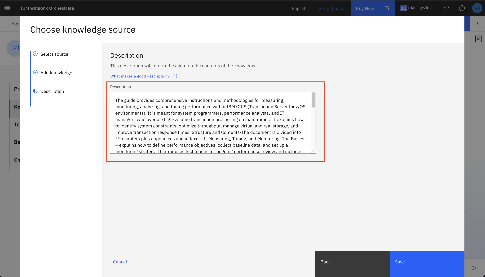

---

### 🚨 Deploy the Ops Agent! 🚨

In your Op Supervisor Agent:

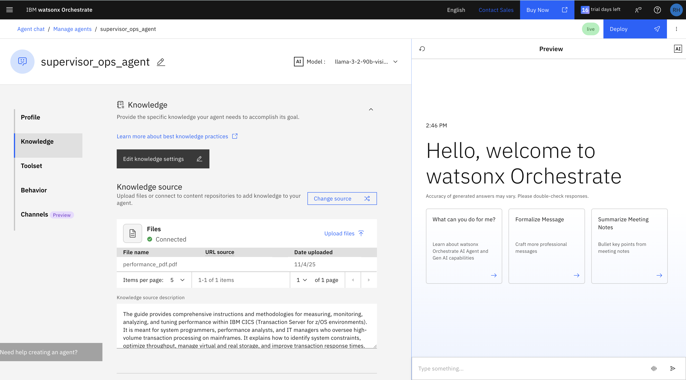

❗ Make sure you press `Deploy` TWICE on the Ops Agent in Orchestrate before testing! ❗

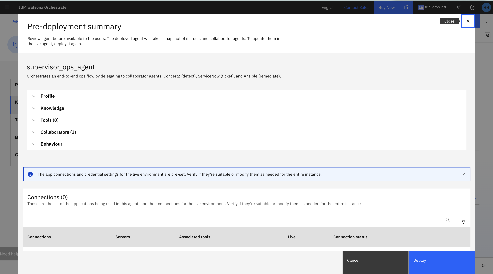

Now navigate to the agent chat in the top left


Click the dropdown and select your supervisor chat

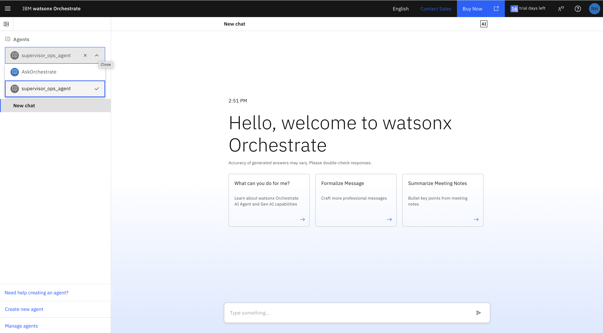

<p align="center"> Let's see it end to end! 👀 </p>

---

## Step 6 - End-to-end Flow

> Let's run through a full flow of the process with the agents working together!

Ops Agent overall flow and continuation of the story:

> It’s the Friday after the U.S. Thanksgiving holiday — Black Friday, one of the busiest shopping days of the year.
>
> A Site Reliability Engineer (SRE) wo;; instead of manually mointoring, turn to the embedded watsonx orchestrate agent, (clicking on the icon in the lower right corner of the site). They ask the agent to show more details for the CICS region CICST11D. After receiving a response and scrolling through the information provided, they identify that the Maximum Tasks Percentage is extremely high.

**🚨 In your UI ensure that you have the Supervisor Agent selected before starting the flow 🚨**

Enter the following to begin:

```
Show all cicsplexs
```


Now enter this follow-up:

```
Get me all the cics regions
```

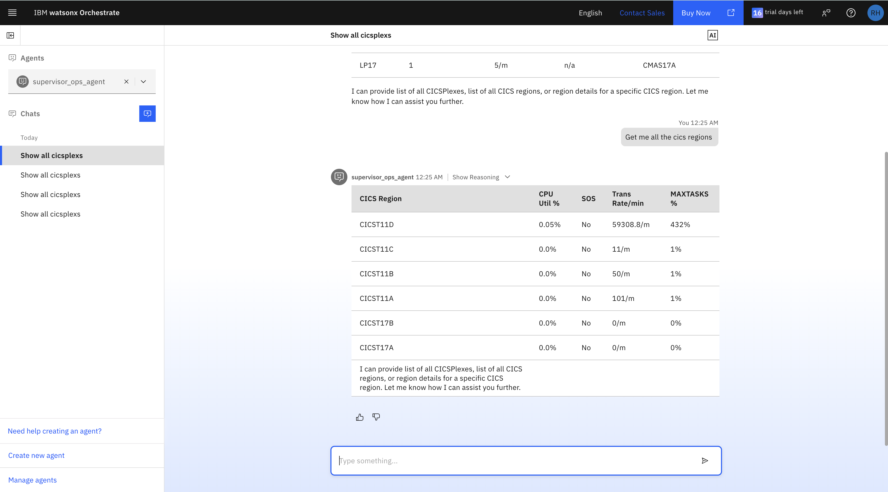

Ask for more details:

```
Show details for CICST11D
```

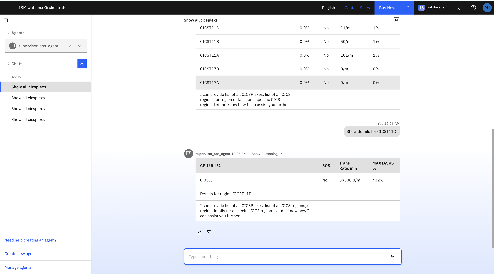

And ask for guidance on resolution:

```
How can I resolve high MAXTASKS percentage?
```

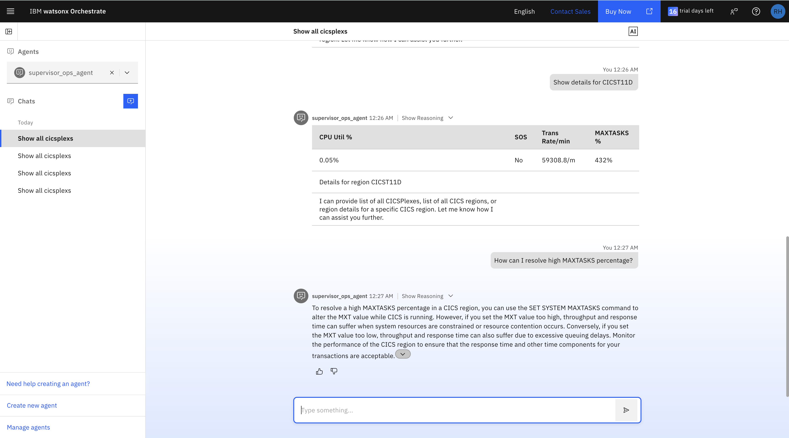

> 📌 To keep things running smoothly and prevent users from seeing slow response times, the SRE submits a Service Now ticket to relieve the bottleneck by asking the watsonx orchestrate agent to increase the maximum tasks and allow CICST11D more access to z/OS resources.

Ask to create a ticket:

```
Please create ticket for CICST11D to resolve high MAXTASK percentage
```

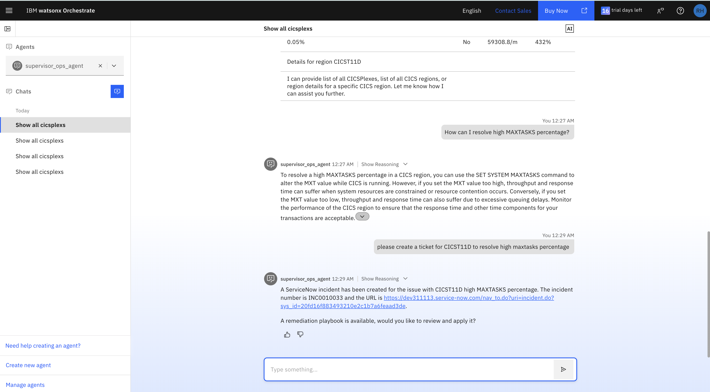

Confirm you want to check it:

```
Yes
```

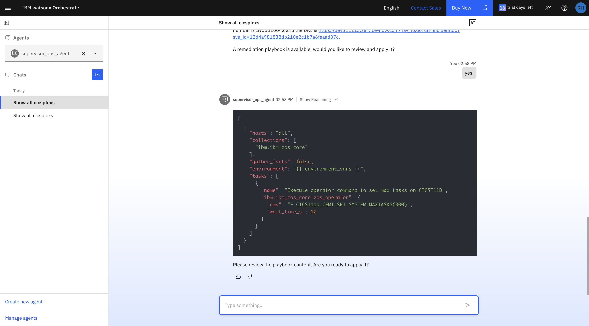

Confirm you would like to apply:

```
Yes
```

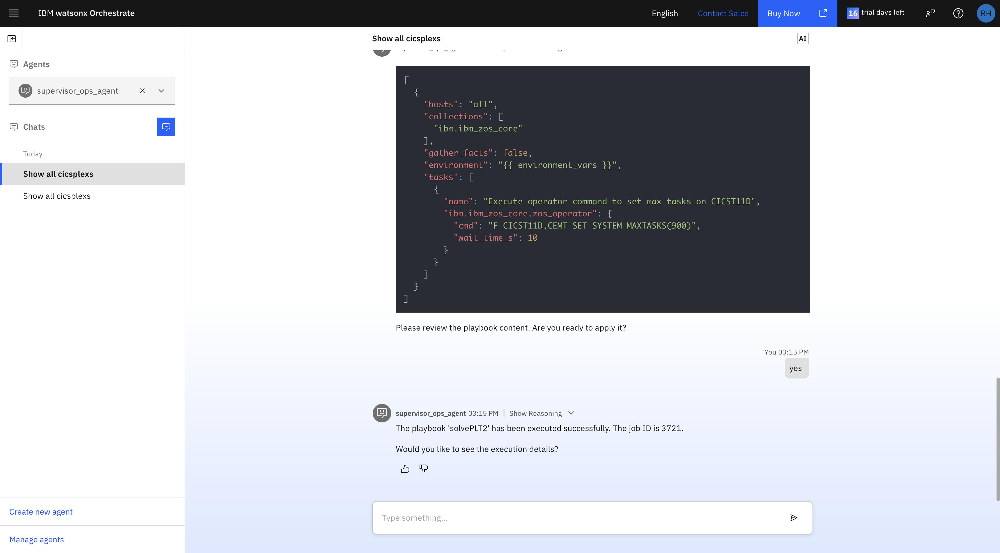

Confirm to see the details:

```
Yes
```

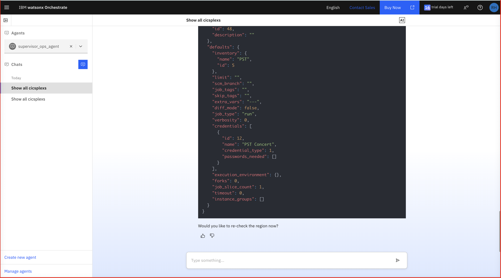

Say yes to check the region again:

```
Yes
```

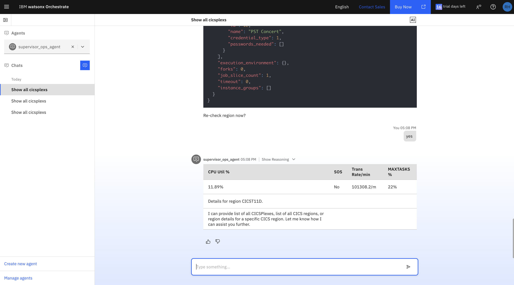

> After the issue was resolved, the system moved from severe oversubscription (MaxTasks 300–500%) to a healthy 10–30%, indicating capacity headroom and reduced contention.
>
> Despite that, throughput actually improved: transaction rate rose from ~65-70K to ~100K per minute, showing bottlenecks were removed and tasks are completing faster. The slight CPU increase (to ~12%) is a positive sign that the processor is doing more productive work rather than idling or waiting.
>
> Overall, these shifts reflect a stable, efficient CICS region delivering higher performance with lower operational stress.

---

<p align="center"> ✨ Congratulations on finishing the Operational Insights Flow! ✨ Please continue to the Resilience APAR Insights Lab ➡️ </p>

--> [Get started on the next lab!](../Resilience_APAR_Insights/3.Resilience_APAR_Flow.md)

---
