> ## Lab - Operational Insights
# Concert for Z Walkthrough

## Table of Contents

- [1. Concert for Z Overview](#1---concert-for-z-overview)
- [2. Walkthrough](#2---walkthrough)
  - [Access to the Exercises](#access-to-the-exercises)
  - [Operations Management — CICS Region Dashboard](#operations-management---cics-region-dashboard)
   
---

## 1 - Concert for Z Overview
> So what even is this thing?? 👀

IBM Concert for Z is an AI-powered observability and automation platform designed specifically for IBM Z (mainframe) environments. It helps operations, DevOps, and site reliability teams monitor, analyze, and optimize mainframe performance — using AI insights and natural language interaction.

🧠 Think of Concert for Z as a **“single control center”** for your Z systems. 

➡️ Instead of checking multiple tools, logs, and dashboards, you can use Concert to:
- See what’s happening across your Z environment
- Get AI-driven alerts and root-cause analysis
- Take guided actions to resolve issues quickly

 [📍Learn more here](https://www.ibm.com/products/concert-for-z)

---

<p align="center"> Let's get started on exploring Concert for Z! 👀✨ </p>

---

## 2 - Walkthrough

> This walkthrough includes an overview of activities and views common to using the Operations Management capabilities in IBM Concert for Z to investigate issues on the mainframe

---

## Access to the Exercises 

Click the following link to bring up the first exercise where there is an anomaly causing problems with a CICS region: 

  -->  [CICS Anomaly exercise link](https://evt-svc-na8.event.techzone.ibm.com:29145/unite-app/dashboard/main?timeRangeStart=2025-10-28T18%3A00%3A00Z&timeRangeEnd=2025-10-29T03%3A00%3A00Z)

> ⚠️ NOTE: If you receive a security warning, accept the risk and advance to access the link


> If required, log in with the following credentials:
> 
> User:
> ```
> sample-admin@zou.ibm.com
> ```
> Password:
> ```
> Concert4z$
> ```

After logging in you'll be at the Operations management Enterprise overview for the specific time range during which an anomaly caused a Concert for Z `event group` to be created. 

The screen that you'll see should be similar to the image below:

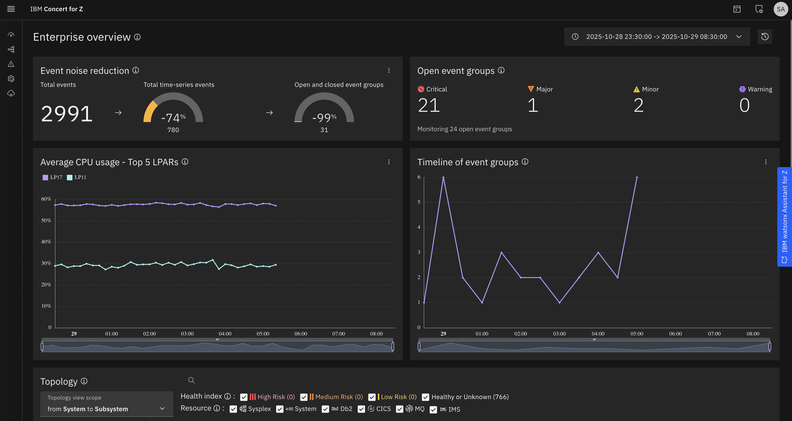

> NOTE: In Concert for Z you have both _Operational Management_ and _Resilience_ - we will be staying in the Operational Management tab for these excercises
>
> 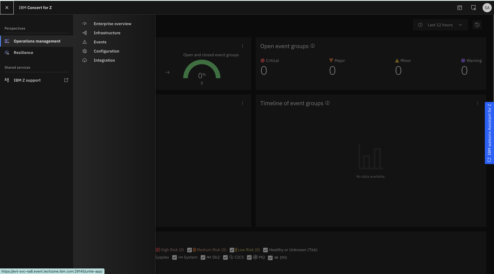

---

<p align="center"> 👀 Time to check out the CICS region dashboard 👀 </p>

---


## Operations Management - CICS Region Dashboard

Select time range to - Last 14 days

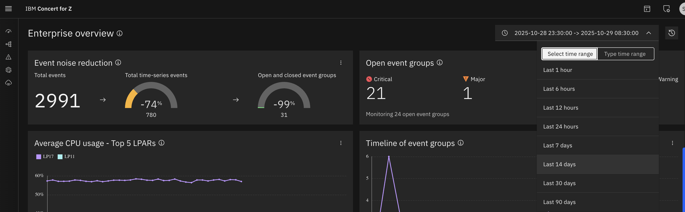

An overview of that CICS region will now be displayed on the right-hand side of the screen: 

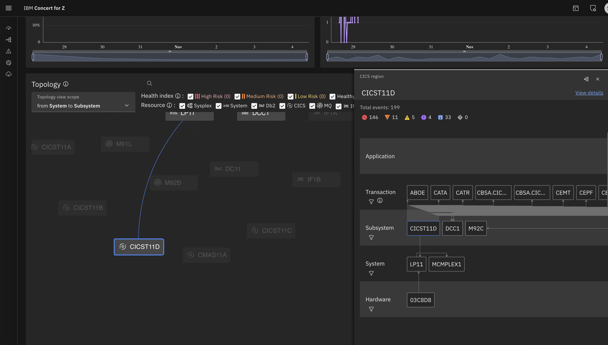

That will bring up a full dashboard for CICS region `CICST11D`

Click the **Overview** tab first (A) at the upper left of the view shown below.

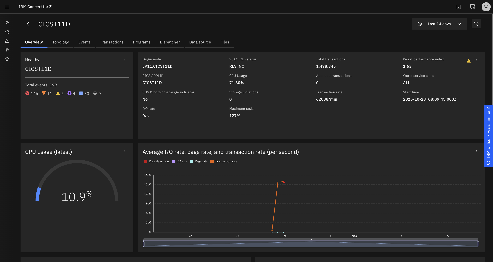

**This is the CICS region overview screen in IBM Concert for Z — a single dashboard that shows the real-time health and performance of the region `CICST11D`**

> On the _left_, the system status is marked as Healthy, with 199 total events categorized by severity, helping operators prioritize what needs attention first.
>
> In the _performance section_, we can see CPU usage at around 71.8%, indicating the region is actively processing workload but still within safe limits. Just below, the live CPU gauge shows a current usage of about 10.9%, reflecting momentary utilization.
>
> _The Maximum Tasks_ value at 127% means the region is operating beyond its nominal task capacity — a sign of high demand that might need tuning if it persists.
>
> We also see over 1.49 million total _transactions_ and a transaction rate of 62,000 per minute, with zero abends — showing the region is stable despite heavy load.

⭐ Concert for Z consolidates these insights in one view, so teams can instantly assess CPU pressure, task saturation, and transaction throughput — all critical indicators of CICS health and performance ⭐

---

<p align="center"> Now that we have checked out the region overview screen, let's move into the events ➡️ </p>

---

- Click on `Events` from left menu bar


> ℹ️ This _Event Groups and Events screen_ in IBM Concert for Z displays all active and historical alerts grouped by severity and resource - it helps operators quickly identify critical issues.
>
> 📍 Here, **42 of 50 open event groups are critical**, mainly related to CICS and z/OS metrics running higher than usual, allowing faster root-cause analysis

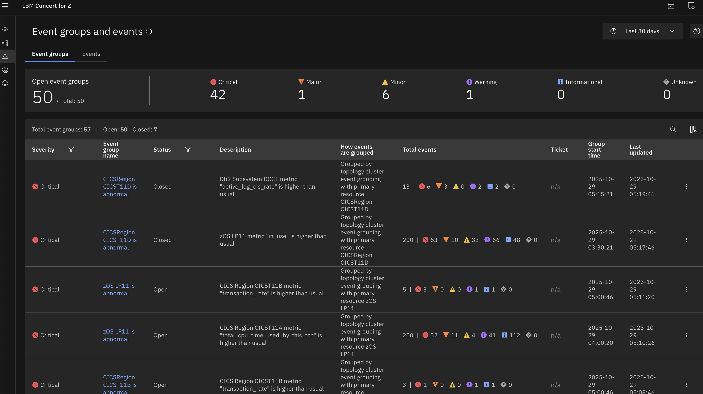

- Filter based on `CICST11D`

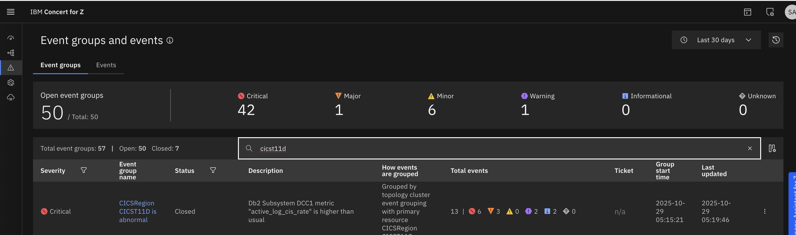

- Click on the open event

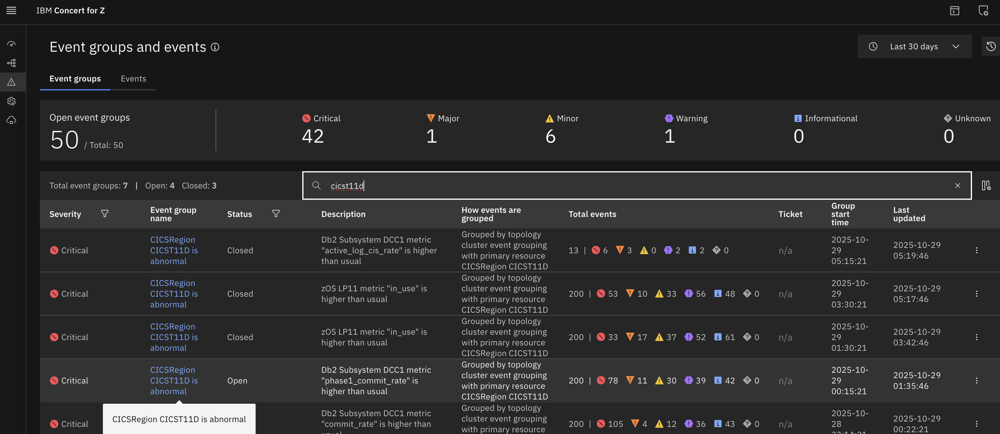

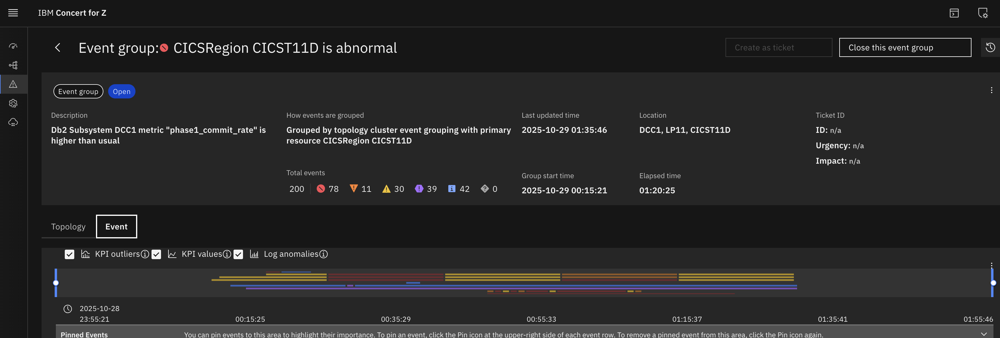

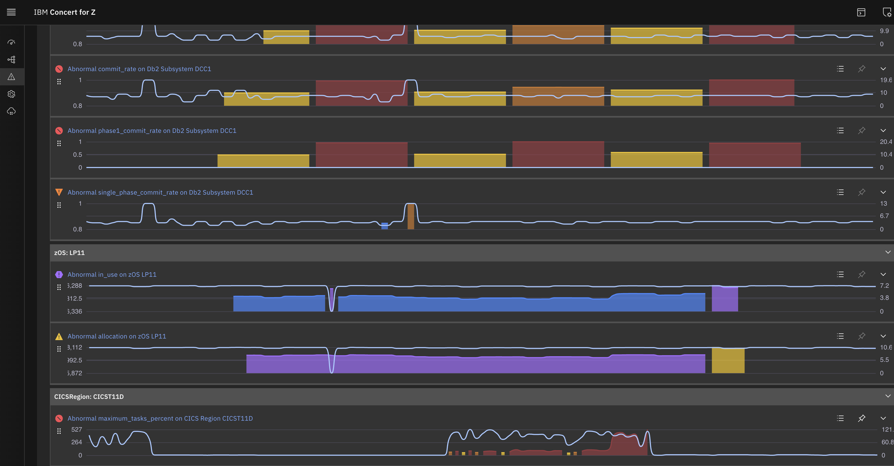

> This screen shows a _detailed event view_ in IBM Concert for Z, highlighting an abnormal spike in maximum task percentage for the CICS region CICST11D.
>
> The _event timeline_ graph below visualizes how the maximum_tasks_percent metric exceeded dynamic thresholds — shown by the red (critical) and yellow (major) zones — indicating that the region temporarily hit or surpassed its task capacity, which could lead to performance slowdowns or queuing under peak load.

- Click on Abnormal `maximum_tasks_percent` on CICS Region CICST11D to get a more detailed view

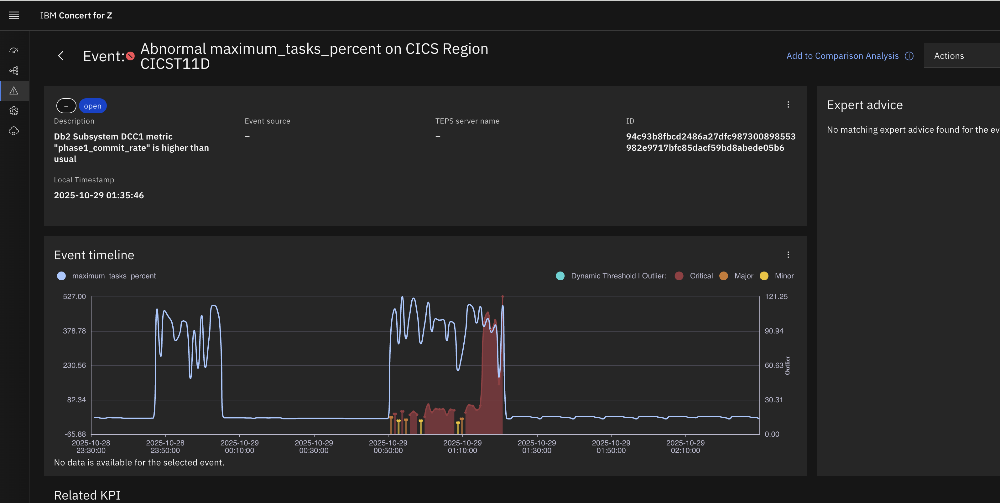

---

### Recap! 

This walkthrough presented a time range during which an anomaly in CICS occurred that caused Concert for Z to create an Event Group. 

The Event Group was explored to understand the problem and isolate the potential root cause. 

⭐ Using Concert for Z features and capabilities, such as Enterprise Overview, Event Groups, and Topology and Subsystem views, you were able to correlate messages and events. ⭐

> NOTE: If you encounter any issues accessing the IBM Concert for Z environment or completing the walkthrough exercises, you can refer to the recorded session for guidance.
>
> _The recording provides a step-by-step demonstration of the access process_ --> [Operational Insights Recording](https://ibm.box.com/s/k1s1xyn2j8ue38mqwp7699y4o3pc2vhf)

---

<p align="center"> ✨  With this understanding of Concert for Z let's dive into the Operational Agentic Flow! ✨ </p>

-->  [Get started on the lab](../Operation_Insights/2.Operational_Agent_Flow.md)

---
