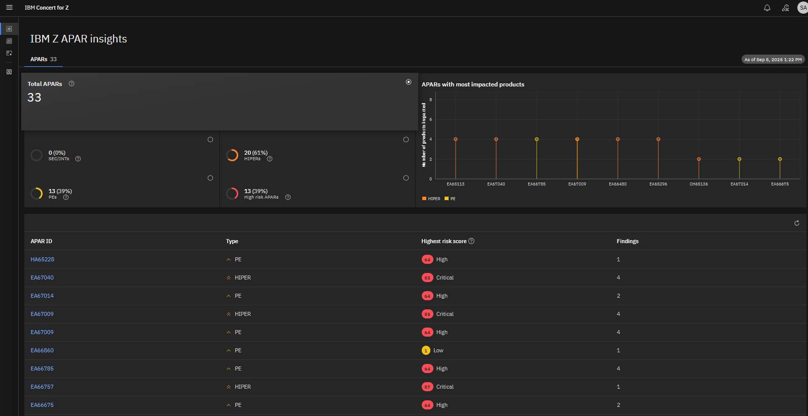
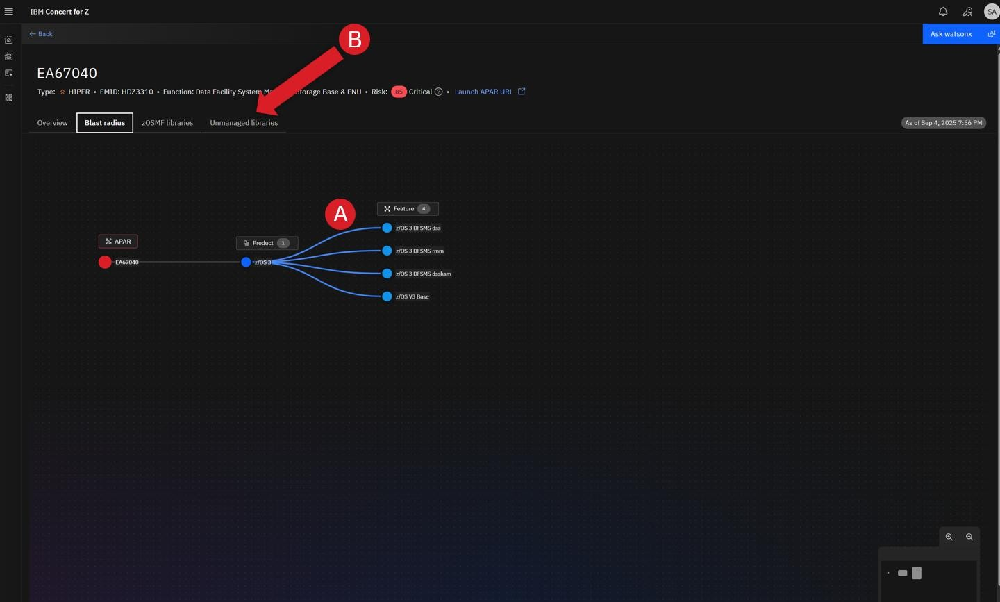

# Table of Contents

- [1 Getting Started](#1-getting-started)
  - [1.2 Resilience -- Z APAR maintenance](#12-resilience--z-apar-maintenance)
    - [1.2.1 Access to exercise](#121-access-to-exercise)
    - [1.2.2 Using the APAR list](#122-using-the-apar-list)

---

# 1 Getting Started

This lab guide supports hands-on labs or demos using the **Concert for Z**
environment that can be provisioned from **Tech Zone**.

---

## 1.2 Resilience -- Z APAR maintenance

In this exercise, you'll explore how **Concert for Z** can help manage
Z APAR maintenance activities.

---

### 1.2.1 Access to exercise

Click the following link to bring up the **Z APAR Insights** lab exercise:

👉 [Z APAR Insights](https://150.239.171.183:12443/concert/#/z_apar?instance_id=0000-0000-0000-0000)

If you receive a security warning, accept the risk and advance to access
the link.


If required, log in with the following credentials:
> 
> User:
> ```
> ibmconcert
> ```
> Password:
> ```
> password
> ```

After logging in, you'll be at the **IBM Z APAR Insights** screen, which
appears similar to the image below.



---

### 1.2.2 Using the APAR list

**Authorized Program Analysis Reports (APARs)** are problem reports for
issues discovered in **z/OS** and the various mainframe subsystems like **Db2**
or **IMS**. When they are fixed, a **Program Temporary Fix (PTF)** is issued.
This cycle of APARs and PTFs occurs on an ongoing basis.

Depending on the severity of the problem, an APAR might be marked as
**Highly Pervasive (HIPER)**. Sometimes, PTFs themselves may have defects.
If so, this will result in the creation of another APAR which is flagged
as a **PTF in Error (PE)**. Both of these types of APARs deserve special
attention as they can reduce mainframe resilience and potentially cause
outages.


As part of its focus on resilience, **IBM Concert for Z** lists all APARs
for which fixes have **not yet been applied** (see the screen above). It
focuses on **HIPER** and **PE** APARs since those potentially present the most
risk to a mainframe environment if not managed in a timely fashion.

Manually tracking this information is error-prone and inefficient.
A list published by IBM, called the **Enhanced HOLDDATA** list, is the
source of new APARs used by the product. In order for **Concert for Z** to
be most useful in understanding the potential impact and risk of
unapplied APARs, **Enhanced HOLDDATA** should be requested daily.

In the screen above:
- The **Total APARs area (A)** allows filtering by type.
- Click **HIPER** to see only HIPER APARs.
- Click **PE** to see only PEs.
- Click **Total APARs** to return to the full list.

The **APARs with most impacted products area (B)** highlights APARs that
impact the most mainframe software products—an indicator of potentially
expansive risk.

The **list area (C)** includes:
- The **type** (PE or HIPER)  
- A **risk score** (based on type and local usage)  
- The **number of products impacted**

To view more details, click **APAR EA67040** (red arrow near D above).
This opens the detailed view shown below.


This screen provides detailed information about the selected APAR to help
assess its risk and determine when to apply the associated PTF.

- **Additional details (A):** Summary of the PTF from *watsonx Assistant for Z*  
- **Recommended mitigation strategy (B):** Suggested steps from *watsonx*  
- **Open findings (C):** List of impacted product/feature combinations  

Click **Blast radius** (red arrow near D) to see these relationships graphically.



The impacted features are shown in the visualization (A above).
Next, click **Unmanaged libraries** (red arrow near B) to see details about
component usage.


Key information:
- **Last used date (A):** Whether the libraries are actively used  
- **System deployed (B):** Systems where they are deployed  

If the libraries are unused, applying the fix may not be immediately
necessary—this decision should align with your organization’s maintenance
policies.

Next, click **Launch APAR URL** (red arrow near C) to open IBM’s support
page for the APAR:


Scroll through the document to understand the issue, impact, and
recommendations. This helps in deciding when to apply the fix.

---

### Summary

This exercise demonstrated how **Concert for Z** simplifies **Z APAR
maintenance**:

- Lists unapplied **HIPER** and **PE APARs**, which are most critical  
- Helps understand the **risk**, **impact**, and **priority** of fixes  


With these capabilities, SMEs can identify and manage unresolved APARs,
ensuring timely fixes and maintaining mainframe resilience.

If you encounter any issues accessing the IBM Concert for Z environment or completing the walkthrough exercises, you can refer to the recorded sessionfor guidance.
The recording provides a step-by-step demonstration of the access process -  [APAR recording](https://ibm.box.com/s/pir2hgyxfrf0bere0iyvucs8vww3wce1)


---

---

<p align="center"> ✨  With this understanding of Concert for Z let's dive into the Resilience Flow! ✨ </p>

-->  [Get started on the lab](../Resilience_APAR_Insights/3.Resilience_APAR_Flow.md)

---
