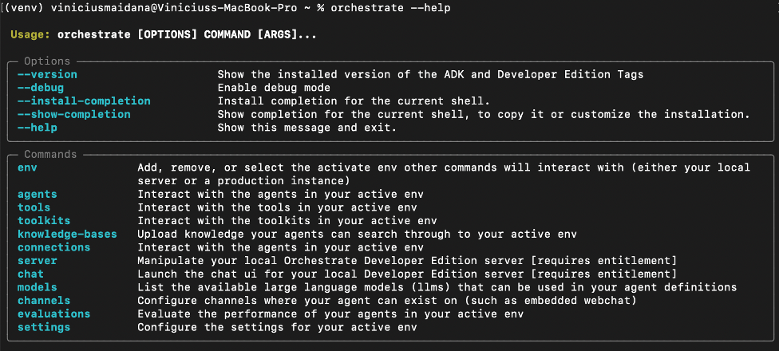
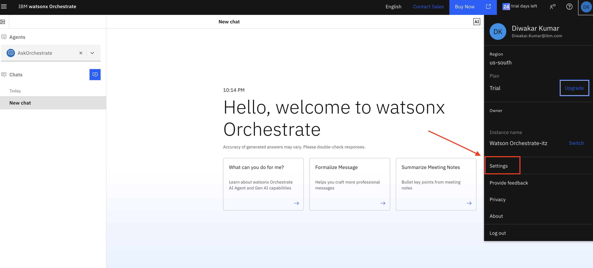
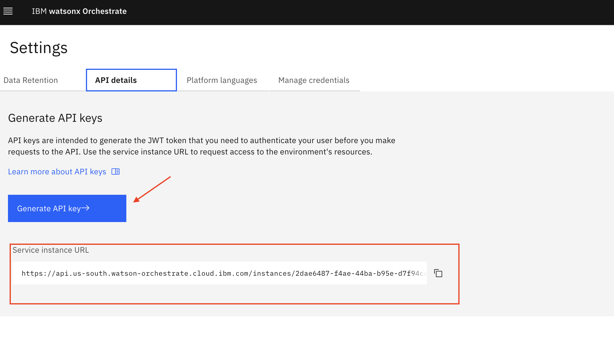
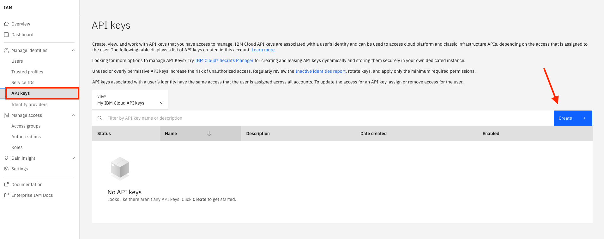
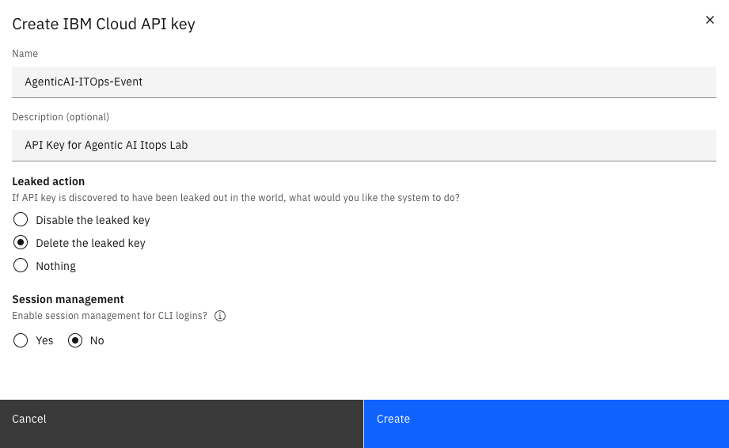
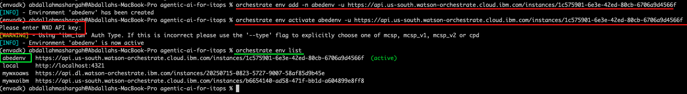

# Hands on Lab Pre-Requisites - Set Up & Configuration
## ITOps Agents using IBM watsonx Orchestrate ADK

To ensure a smooth and productive experience during the IBM TechXchange Workshop: Agentic AI for ITOps, all participants must complete the following setup steps prior to the event on November 6.

We’ve organized the prerequisites into three buckets:

## 1. IBM Environment Access
Set up your IBM credentials and platform access to participate in the hands-on labs.
- Create or verify your IBMid
- Ensure access to the watsonx Orchestrate environment
- Complete any onboarding steps required for environment assignment

## 2. Local Machine Setup
Prepare your personal device with the necessary tools and packages.
- Install Python
- Set up the Agent Development Kit (ADK)
- Verify that your system meets the minimum requirements

## 3. Lab Track Configuration - Distributed Only
Customize your setup based on your selected lab track.

---

## Table of Contents
### Set Up & Configuration Step-by-Step Guide

- [Step 1 – IBM Enviornment Access](#step-1--IBM-Enviornment-access)
- [Step 2 – Local Machine Setup](#step-2--local-machine-setup) 
- [Step 3 – Distributed Lab Track Configuration](#step-3--distributed-lab-track-configuration)
  
---
##  Step 1 – IBM Enviornment Access  

### IBMid Creation Instructions

#### 1. Create IBMid
**To access an environment for the lab, please follow the instructions here as a part of the pre requisites.<br>** 
  - Start by accessing the IBMid registration page. [IBMid Creation](https://www.ibm.com/account/reg/us-en/signup?formid=urx-19776)<br>
  - Enter the required information in the fields provided, such as email address, name, company, and country.<br>
    _IMPORTANT: Your email address becomes your IBMid, which you will use to access the bootcamp environment!<br>_
  - Click the **Next** button. You will receive an email containing a one-time verification code.<br>
  - Go back to the registration page, enter the code that is provided in the email in the Verification Token field.<br>
  - Click **Submit** to create an account.<br>
  - **An email will be sent indicating that your IBMid account creation was successful and your account is now activated**.<br>
---
#### 2. Email Confirmation

**Email Aishwarya Hariharan to confirm you have registered and received the IBMid.**
```
aishwarya.hariharan@ibm.com
```

---
#### 3. Join IBM Cloud Account
**Please follow the instructions here as a part of the prerequisites to ensure that you can access watsonX orchestrate during the event.<br>**
  - Once you receive an email from IBM Cloud, start by accessing the email from no-reply@cloud.ibm.com. The subject should be _"Action required: You are invited to join an account in IBM Cloud."_ <br>
  - Click on **"Join now"** in the email to join the IBMid account you have been assigned to.<br>
  - Accept the Terms and Conditions in the IBM Cloud page to finish joining the account. Click on the **"Join Account"** button.<br>
  - You will be routed to the Login page. Log in with your IBMid. <br>
       _NOTE: If you have another account on IBM cloud, you will see a popup asking if you can be switched to this account. Go ahead and click Proceed._
  - Once logged in, confirm that you are in the right IBM Cloud account. This should match the account details from the IBM Cloud email.<br>
---
#### 4. Confirm watsonx Orchestrate Access
**Once you have completed these steps, verify your watsonx Orchestrate access with these steps:<br>** 
  - On the [IBM Cloud landing page](https://cloud.ibm.com), click the top left navigation menu (hamburger menu) and select **Resource List**.<br>
       _NOTE: If you are a member of multiple IBM Cloud accounts, make sure you are working in the correct account which has the required services available.<br>_
  - On the Resource List page, expand the AI / Machine Learning section, and click the watsonx Orchestrate service name.<br>
  - Click **Launch** watsonx Orchestrate to launch the service.<br>

---

##  Step 2 - Local Machine Setup

  - [1 – Install Python 3.11+](#1--install-python-311+)
  - [2 – Clone the Repository](#2--clone-the-repository)
  - [3 – Navigate into the Project Folder](#3--navigate-into-the-project-folder)
  - [4 – Create and Activate a Virtual Environment](#4--create-and-activate-a-virtual-environment)
  - [5 – Install and Validate ADK](#5--install-and-validate-adk)
  - [6 – Activate Environment](#6--activate-environment)

---

### 1 – Install Python 3.11+
*We need a compatible Python version because the watsonx Orchestrate ADK relies on modern language features and libraries that are only supported in Python 3.11 or higher*.

Make sure **Python 3.11 or above** (up to 3.13) is installed. 
[Download Python](https://www.python.org/downloads/)

---

### 2 – Clone the Repository

In your terminal enter the following:

```bash
git clone <gitrepo>
```
**NOTE: If you do not have Git you will need to get free Git CLI from - https://git-scm.com/**

*Cloning the repo gives you access to all the pre-built scripts, YAML files, and configurations required for agent creation and orchestration.*

---

### 3 – Navigate into the Project Folder

To ensure you are in the correct place, in your terminal enter the following:

```bash
cd AgenticAIforITOps/<HandsonLab\ Track>
```
---

### 4 – Create and Activate a Virtual Environment

In your terminal now enter: 

```bash
python -m venv envadk
source envadk/bin/activate
```
*A virtual environment isolates dependencies, preventing conflicts with other Python projects and ensuring a clean setup for the ADK.*

---

### 5 – Install and Validate ADK

> _Wait what is ADK??_
> 
> The IBM watsonx Orchestrate Agent Development Kit (ADK) is a set of tools designed to make it easy to build and deploy agents using IBM watsonx Orchestrate. It is packaged as a Python library and command line tool that allows builders to configure agents that run on the IBM watsonx Orchestrate platform. The ADK also supports integrating agents and tools built on other frameworks.
>
> [Click to learn more](https://developer.watson-orchestrate.ibm.com/)

Enter the following commands into your terminal:

```bash
pip install ibm-watsonx-orchestrate

orchestrate --version
```

After you are done with the installation process, check if your instance is working properly with the command:

```bash
orchestrate --help
```

If everything is set up correctly, you’ll see a list of available ADK CLI commands, like in the following screenshot.



**Note: If you encounter issues, please ensure your Python version is 3.11 or higher (up to 3.13). Depending on your system setup, you may need to use the python3 and pip3 commands explicitly, rather than python and pip.**

*Installing the watsonx Orchestrate ADK provides the core tools for building and managing agents.* 

---

### 6 – Activate Environment

_Now that you've installed the ADK, it's time to connect it to your watsonx Orchestrate SaaS instance so that you can deploy your agents directly to your SaaS environment._

*For the series of steps here, you can access watsonx Orchestrate by following the steps below:*
  - On the [IBM Cloud landing page](https://cloud.ibm.com), click the top left navigation menu (hamburger menu) and select **Resource List**.<br>
       _NOTE: If you are a member of multiple IBM Cloud accounts, make sure you are working in the correct account which has the required services available.<br>_
  - On the Resource List page, expand the AI / Machine Learning section, and click the watsonx Orchestrate service name.<br>
  - Click **Launch** watsonx Orchestrate to launch the service.<br>

To connect the ADK to your watsonx Orchestrate instance, generate an API key using the instructions below:
- On the top right of your watsonx Orchestrate Launch page, click on your initials.
- In the menu, click on Settings, as highlighted in the image below. 



- You will be routed to the Settings page on the platform. Click on the API details tab. 

As highlighted by the red arrow in the screenshot below, click on the Generate API Key blue button. Also here, **copy and save the service instance URL** (as shown in the red box) - you will need this later. 



In the API keys menu, click Create button.



In the Create IBM Cloud API key page do the following:
- Enter a name and description for your API Key.
- In the Leaked key section, select delete if a key is discovered.
- In the Select creation section, choose no for if the API key should create a session in the CLI.



Go back to your terminal session and run the following command:

**Replace <environment-name> with a name of your choice for your environment and <Service-instance-url> with the service instance URL you copied earlier.**

```bash
orchestrate env add -n <environment-name> -u <Service-instance-url>

orchestrate env activate <environment-name> -u <Service-instance-url>
```

For example: 

```bash
orchestrate env add -n mytestenv -u https://api.us-south.watson-orchestrate.cloud.ibm.com/instances/1d34d19c-bf90-447b-a9f9-122be17fdae5i

orchestrate env activate mytestenv --api-key m77y491hZNMUEj9bQcddexqZl_UnkFeuQRvAaHEt8Nkwi
```

You can verify by listing the environments. 

```bash
orchestrate env list
```



If everything works, you will get a message that the environment has been successfully created as is already activated. 

---

##  Step 3 – Distributed Lab Track Configuration

### RedHat / Quay.io
Create a free account on Quay.io by hitting "Sign In with Red Hat" followed by "Register for a Red Hat account". 

[Create Account](https://quay.io/repository/)


### GitHub
Create an account on GitHub if you don't already have one

[GitHub Account](https://github.com)

--- 
Congratulations! You are ready to now move into Agent Creation during the Hands-On Lab Session!
